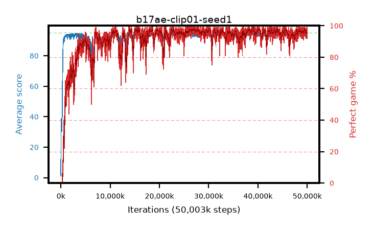

# b17ae-clip01-seed1

step **50,003,968** · 3052 evals · trailing **93.71** · peak **94.52** @38,961,152 · sef **90.8** · best30 **97.8** @39,092,224

## Config

| | |
|---|---|
| algo | ppo |
| collect_envs | 128 |
| discount | 0.99 |
| eval_interval | 16384 |
| eval_queue | True |
| eval_queue_depth | 16 |
| eval_workers | 8 |
| fc_layers | (320,) |
| graph_eval_episodes | 100 |
| max_steps | 50003968 |
| min_checkpoint_score | 40.0 |
| ppo_adam_epsilon | 1e-07 |
| ppo_anneal_fraction | 1.0 |
| ppo_clip | 0.1 |
| ppo_clip_final | None |
| ppo_entropy_coef | 0.01 |
| ppo_entropy_coef_final | None |
| ppo_epochs | 4 |
| ppo_gae_lambda | 0.98 |
| ppo_gradient_clipping | 0.5 |
| ppo_horizon | 33.6 |
| ppo_learning_rate | 0.0003 |
| ppo_learning_rate_final | None |
| ppo_minibatch | 256 |
| ppo_normalize_adv | True |
| ppo_rollout | 128 |
| ppo_target_kl | 0.0 |
| ppo_transitions_per_rollout | 16384 |
| ppo_value_loss | huber |
| ppo_vf_coef | 0.5 |
| seed | 1 |
| torch_threads | 1 |

## Evals

| step | avg score | trailing avg | min score | max score | avg reward | perfect % | epsilon |
|---|---|---|---|---|---|---|---|
| 16384 | 1.16 | 1.16 | 0.0 | 5.0 | -3.673 | 0.0 |  |
| 32768 | 25.64 | 13.4 | 10.0 | 50.0 | 23.253 | 0.0 |  |
| 49152 | 38.93 | 21.91 | 10.0 | 73.0 | 33.825 | 0.0 |  |
| ... | ... | ... | ... | ... | ... | ... | ... |
| 49823744 | 94.98 | 93.82 | 93.0 | 95.0 | 192.67 | 99.0 |  |
| 49840128 | 93.64 | 93.83 | 3.0 | 95.0 | 188.345 | 96.0 |  |
| 49856512 | 93.43 | 93.78 | 7.0 | 95.0 | 188.15 | 96.0 |  |
| 49872896 | 94.26 | 93.72 | 61.0 | 95.0 | 187.979 | 95.0 |  |
| 49889280 | 93.29 | 93.73 | 3.0 | 95.0 | 187.018 | 95.0 |  |
| 49905664 | 93.7 | 93.91 | 22.0 | 95.0 | 187.424 | 95.0 |  |
| 49922048 | 93.25 | 93.86 | 8.0 | 95.0 | 188.968 | 97.0 |  |
| 49938432 | 94.85 | 93.88 | 86.0 | 95.0 | 191.547 | 98.0 |  |
| 49954816 | 93.68 | 93.77 | 57.0 | 95.0 | 184.392 | 92.0 |  |
| 49971200 | 94.72 | 93.77 | 84.0 | 95.0 | 189.421 | 96.0 |  |
| 49987584 | 94.97 | 93.73 | 92.0 | 95.0 | 192.662 | 99.0 |  |
| 50003968 | 94.03 | 93.71 | 22.0 | 95.0 | 188.691 | 96.0 |  |
