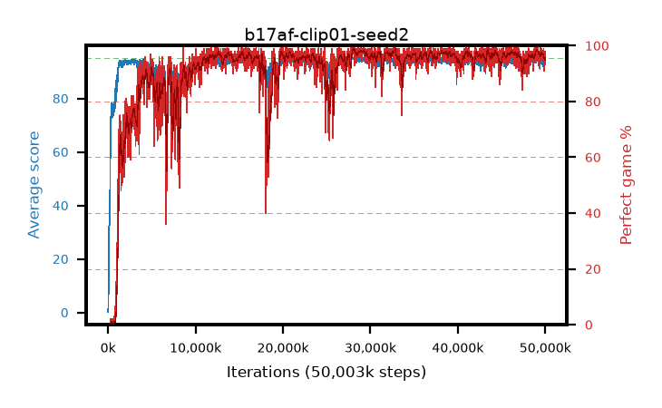

# b17af-clip01-seed2

step **50,003,968** · 3052 evals · trailing **93.5** · peak **94.72** @28,327,936 · sef **88.8** · best30 **98.2** @28,262,400

## Config

| | |
|---|---|
| algo | ppo |
| collect_envs | 128 |
| discount | 0.99 |
| eval_interval | 16384 |
| eval_queue | True |
| eval_queue_depth | 16 |
| eval_workers | 8 |
| fc_layers | (320,) |
| graph_eval_episodes | 100 |
| max_steps | 50003968 |
| min_checkpoint_score | 40.0 |
| ppo_adam_epsilon | 1e-07 |
| ppo_anneal_fraction | 1.0 |
| ppo_clip | 0.1 |
| ppo_clip_final | None |
| ppo_entropy_coef | 0.01 |
| ppo_entropy_coef_final | None |
| ppo_epochs | 4 |
| ppo_gae_lambda | 0.98 |
| ppo_gradient_clipping | 0.5 |
| ppo_horizon | 33.6 |
| ppo_learning_rate | 0.0003 |
| ppo_learning_rate_final | None |
| ppo_minibatch | 256 |
| ppo_normalize_adv | True |
| ppo_rollout | 128 |
| ppo_target_kl | 0.0 |
| ppo_transitions_per_rollout | 16384 |
| ppo_value_loss | huber |
| ppo_vf_coef | 0.5 |
| seed | 2 |
| torch_threads | 1 |

## Evals

| step | avg score | trailing avg | min score | max score | avg reward | perfect % | epsilon |
|---|---|---|---|---|---|---|---|
| 16384 | 0.17 | 0.17 | 0.0 | 2.0 | -4.52 | 0.0 |  |
| 32768 | 2.1 | 1.14 | 0.0 | 7.0 | -2.16 | 0.0 |  |
| 49152 | 7.99 | 3.42 | 0.0 | 20.0 | 3.835 | 0.0 |  |
| ... | ... | ... | ... | ... | ... | ... | ... |
| 49823744 | 91.88 | 93.68 | 5.0 | 95.0 | 181.637 | 91.0 |  |
| 49840128 | 92.66 | 93.67 | 9.0 | 95.0 | 182.4 | 91.0 |  |
| 49856512 | 92.65 | 93.67 | 3.0 | 95.0 | 187.398 | 96.0 |  |
| 49872896 | 93.87 | 93.64 | 57.0 | 95.0 | 185.612 | 93.0 |  |
| 49889280 | 92.98 | 93.57 | 5.0 | 95.0 | 186.675 | 95.0 |  |
| 49905664 | 94.37 | 93.51 | 51.0 | 95.0 | 191.099 | 98.0 |  |
| 49922048 | 93.17 | 93.69 | 5.0 | 95.0 | 185.915 | 94.0 |  |
| 49938432 | 93.55 | 93.75 | 5.0 | 95.0 | 189.283 | 97.0 |  |
| 49954816 | 92.93 | 93.66 | 1.0 | 95.0 | 187.671 | 96.0 |  |
| 49971200 | 93.79 | 93.72 | 3.0 | 95.0 | 190.512 | 98.0 |  |
| 49987584 | 93.74 | 93.47 | 7.0 | 95.0 | 188.459 | 96.0 |  |
| 50003968 | 92.55 | 93.5 | 5.0 | 95.0 | 185.291 | 94.0 |  |
