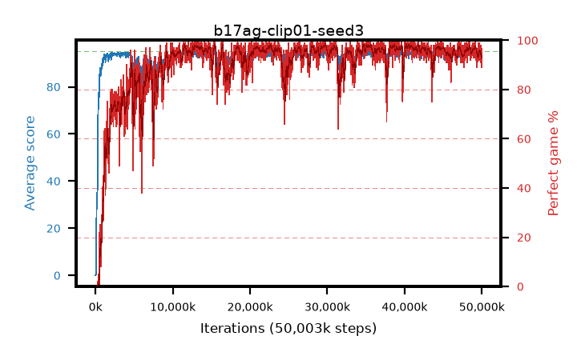

# b17ag-clip01-seed3

step **50,003,968** · 3052 evals · trailing **94.1** · peak **94.51** @49,217,536 · sef **88.1** · best30 **97.8** @40,517,632

## Config

| | |
|---|---|
| algo | ppo |
| collect_envs | 128 |
| discount | 0.99 |
| eval_interval | 16384 |
| eval_queue | True |
| eval_queue_depth | 16 |
| eval_workers | 8 |
| fc_layers | (320,) |
| graph_eval_episodes | 100 |
| max_steps | 50003968 |
| min_checkpoint_score | 40.0 |
| ppo_adam_epsilon | 1e-07 |
| ppo_anneal_fraction | 1.0 |
| ppo_clip | 0.1 |
| ppo_clip_final | None |
| ppo_entropy_coef | 0.01 |
| ppo_entropy_coef_final | None |
| ppo_epochs | 4 |
| ppo_gae_lambda | 0.98 |
| ppo_gradient_clipping | 0.5 |
| ppo_horizon | 33.6 |
| ppo_learning_rate | 0.0003 |
| ppo_learning_rate_final | None |
| ppo_minibatch | 256 |
| ppo_normalize_adv | True |
| ppo_rollout | 128 |
| ppo_target_kl | 0.0 |
| ppo_transitions_per_rollout | 16384 |
| ppo_value_loss | huber |
| ppo_vf_coef | 0.5 |
| seed | 3 |
| torch_threads | 1 |

## Evals

| step | avg score | trailing avg | min score | max score | avg reward | perfect % | epsilon |
|---|---|---|---|---|---|---|---|
| 16384 | 0.04 | 0.04 | 0.0 | 1.0 | -4.961 | 0.0 |  |
| 32768 | 0.39 | 0.21 | 0.0 | 3.0 | -0.165 | 0.0 |  |
| 49152 | 0.26 | 0.23 | 0.0 | 2.0 | -0.289 | 0.0 |  |
| ... | ... | ... | ... | ... | ... | ... | ... |
| 49823744 | 93.99 | 94.08 | 71.0 | 95.0 | 185.721 | 93.0 |  |
| 49840128 | 92.97 | 94.03 | 6.0 | 95.0 | 182.709 | 91.0 |  |
| 49856512 | 93.5 | 94.09 | 14.0 | 95.0 | 185.231 | 93.0 |  |
| 49872896 | 93.73 | 94.01 | 64.0 | 95.0 | 185.453 | 93.0 |  |
| 49889280 | 93.14 | 93.98 | 20.0 | 95.0 | 184.869 | 93.0 |  |
| 49905664 | 94.33 | 94.02 | 67.0 | 95.0 | 186.954 | 94.0 |  |
| 49922048 | 94.66 | 94.02 | 74.0 | 95.0 | 191.369 | 98.0 |  |
| 49938432 | 93.15 | 94.06 | 4.0 | 95.0 | 183.821 | 92.0 |  |
| 49954816 | 94.29 | 94.06 | 68.0 | 95.0 | 187.006 | 94.0 |  |
| 49971200 | 93.7 | 94.14 | 58.0 | 95.0 | 181.431 | 89.0 |  |
| 49987584 | 94.34 | 94.14 | 71.0 | 95.0 | 187.073 | 94.0 |  |
| 50003968 | 92.9 | 94.1 | 16.0 | 95.0 | 181.543 | 90.0 |  |
