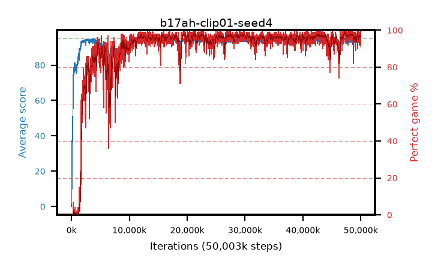

# b17ah-clip01-seed4

step **50,003,968** · 3052 evals · trailing **94.21** · peak **94.56** @47,579,136 · sef **90.6** · best30 **98.2** @47,497,216

## Config

| | |
|---|---|
| algo | ppo |
| collect_envs | 128 |
| discount | 0.99 |
| eval_interval | 16384 |
| eval_queue | True |
| eval_queue_depth | 16 |
| eval_workers | 8 |
| fc_layers | (320,) |
| graph_eval_episodes | 100 |
| max_steps | 50003968 |
| min_checkpoint_score | 40.0 |
| ppo_adam_epsilon | 1e-07 |
| ppo_anneal_fraction | 1.0 |
| ppo_clip | 0.1 |
| ppo_clip_final | None |
| ppo_entropy_coef | 0.01 |
| ppo_entropy_coef_final | None |
| ppo_epochs | 4 |
| ppo_gae_lambda | 0.98 |
| ppo_gradient_clipping | 0.5 |
| ppo_horizon | 33.6 |
| ppo_learning_rate | 0.0003 |
| ppo_learning_rate_final | None |
| ppo_minibatch | 256 |
| ppo_normalize_adv | True |
| ppo_rollout | 128 |
| ppo_target_kl | 0.0 |
| ppo_transitions_per_rollout | 16384 |
| ppo_value_loss | huber |
| ppo_vf_coef | 0.5 |
| seed | 4 |
| torch_threads | 1 |

## Evals

| step | avg score | trailing avg | min score | max score | avg reward | perfect % | epsilon |
|---|---|---|---|---|---|---|---|
| 16384 | 0.04 | 0.04 | 0.0 | 1.0 | -4.123 | 0.0 |  |
| 32768 | 2.69 | 1.36 | 0.0 | 8.0 | 1.199 | 0.0 |  |
| 49152 | 12.96 | 5.23 | 0.0 | 31.0 | 8.678 | 0.0 |  |
| ... | ... | ... | ... | ... | ... | ... | ... |
| 49823744 | 94.1 | 94.17 | 14.0 | 95.0 | 190.815 | 98.0 |  |
| 49840128 | 94.8 | 94.2 | 81.0 | 95.0 | 191.517 | 98.0 |  |
| 49856512 | 93.36 | 94.15 | 28.0 | 95.0 | 188.072 | 96.0 |  |
| 49872896 | 94.24 | 94.13 | 32.0 | 95.0 | 189.947 | 97.0 |  |
| 49889280 | 93.88 | 94.23 | 16.0 | 95.0 | 189.555 | 97.0 |  |
| 49905664 | 94.22 | 94.24 | 62.0 | 95.0 | 189.93 | 97.0 |  |
| 49922048 | 92.85 | 94.18 | 7.0 | 95.0 | 182.586 | 91.0 |  |
| 49938432 | 94.72 | 94.24 | 84.0 | 95.0 | 190.446 | 97.0 |  |
| 49954816 | 95.0 | 94.21 | 95.0 | 95.0 | 193.719 | 100.0 |  |
| 49971200 | 94.81 | 94.27 | 85.0 | 95.0 | 191.535 | 98.0 |  |
| 49987584 | 94.39 | 94.25 | 63.0 | 95.0 | 190.1 | 97.0 |  |
| 50003968 | 94.87 | 94.21 | 88.0 | 95.0 | 191.586 | 98.0 |  |
