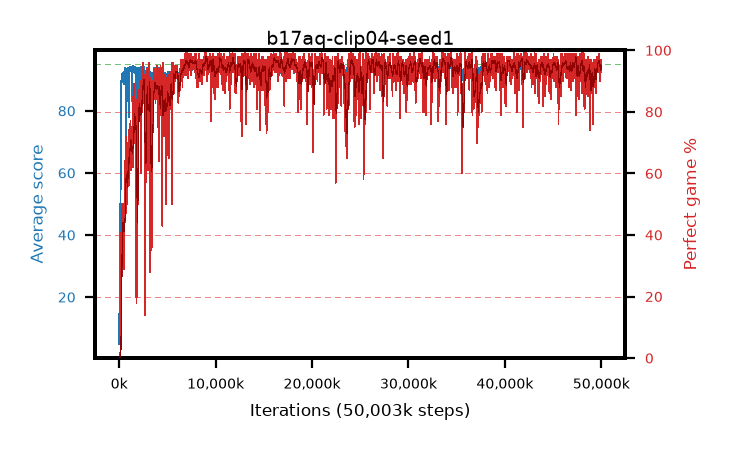

# b17aq-clip04-seed1

step **50,003,968** · 3052 evals · trailing **94.08** · peak **94.39** @47,382,528 · sef **92.4** · best30 **96.8** @16,449,536

## Config

| | |
|---|---|
| algo | ppo |
| collect_envs | 128 |
| discount | 0.99 |
| eval_interval | 16384 |
| eval_queue | True |
| eval_queue_depth | 16 |
| eval_workers | 8 |
| fc_layers | (320,) |
| graph_eval_episodes | 100 |
| max_steps | 50003968 |
| min_checkpoint_score | 40.0 |
| ppo_adam_epsilon | 1e-07 |
| ppo_anneal_fraction | 1.0 |
| ppo_clip | 0.4 |
| ppo_clip_final | None |
| ppo_entropy_coef | 0.01 |
| ppo_entropy_coef_final | None |
| ppo_epochs | 4 |
| ppo_gae_lambda | 0.98 |
| ppo_gradient_clipping | 0.5 |
| ppo_horizon | 33.6 |
| ppo_learning_rate | 0.0003 |
| ppo_learning_rate_final | None |
| ppo_minibatch | 256 |
| ppo_normalize_adv | True |
| ppo_rollout | 128 |
| ppo_target_kl | 0.0 |
| ppo_transitions_per_rollout | 16384 |
| ppo_value_loss | huber |
| ppo_vf_coef | 0.5 |
| seed | 1 |
| torch_threads | 1 |

## Evals

| step | avg score | trailing avg | min score | max score | avg reward | perfect % | epsilon |
|---|---|---|---|---|---|---|---|
| 16384 | 4.86 | 13.0 | 0.0 | 39.0 | 3.849 | 0.0 |  |
| 32768 | 21.15 | 21.15 | 3.0 | 39.0 | 16.131 | 0.0 |  |
| 49152 | 22.21 | 16.07 | 6.0 | 48.0 | 17.187 | 0.0 |  |
| ... | ... | ... | ... | ... | ... | ... | ... |
| 49823744 | 92.3 | 94.01 | 16.0 | 95.0 | 180.909 | 90.0 |  |
| 49840128 | 94.18 | 94.01 | 54.0 | 95.0 | 186.828 | 94.0 |  |
| 49856512 | 94.12 | 94.01 | 56.0 | 95.0 | 187.822 | 95.0 |  |
| 49872896 | 92.85 | 93.84 | 24.0 | 95.0 | 183.57 | 92.0 |  |
| 49889280 | 94.34 | 93.9 | 73.0 | 95.0 | 188.056 | 95.0 |  |
| 49905664 | 92.89 | 93.89 | 16.0 | 95.0 | 182.624 | 91.0 |  |
| 49922048 | 93.58 | 94.05 | 16.0 | 95.0 | 186.298 | 94.0 |  |
| 49938432 | 93.63 | 93.98 | 20.0 | 95.0 | 189.349 | 97.0 |  |
| 49954816 | 94.51 | 94.04 | 74.0 | 95.0 | 190.213 | 97.0 |  |
| 49971200 | 94.6 | 93.94 | 71.0 | 95.0 | 189.319 | 96.0 |  |
| 49987584 | 92.62 | 93.9 | 18.0 | 95.0 | 187.347 | 96.0 |  |
| 50003968 | 93.91 | 94.08 | 16.0 | 95.0 | 189.634 | 97.0 |  |
