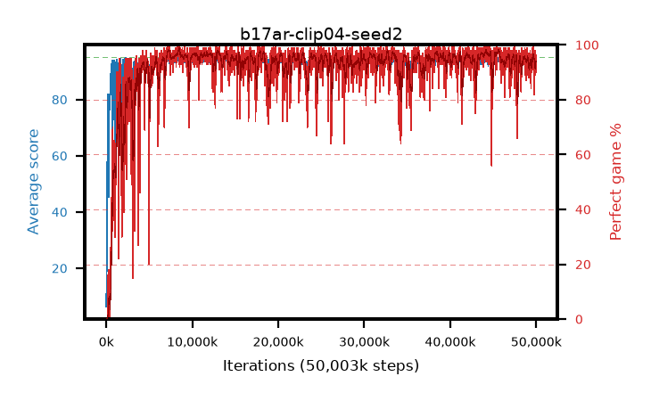

# b17ar-clip04-seed2

step **50,003,968** · 3052 evals · trailing **93.99** · peak **94.39** @45,481,984 · sef **92.7** · best30 **97.5** @8,503,296

## Config

| | |
|---|---|
| algo | ppo |
| collect_envs | 128 |
| discount | 0.99 |
| eval_interval | 16384 |
| eval_queue | True |
| eval_queue_depth | 16 |
| eval_workers | 8 |
| fc_layers | (320,) |
| graph_eval_episodes | 100 |
| max_steps | 50003968 |
| min_checkpoint_score | 40.0 |
| ppo_adam_epsilon | 1e-07 |
| ppo_anneal_fraction | 1.0 |
| ppo_clip | 0.4 |
| ppo_clip_final | None |
| ppo_entropy_coef | 0.01 |
| ppo_entropy_coef_final | None |
| ppo_epochs | 4 |
| ppo_gae_lambda | 0.98 |
| ppo_gradient_clipping | 0.5 |
| ppo_horizon | 33.6 |
| ppo_learning_rate | 0.0003 |
| ppo_learning_rate_final | None |
| ppo_minibatch | 256 |
| ppo_normalize_adv | True |
| ppo_rollout | 128 |
| ppo_target_kl | 0.0 |
| ppo_transitions_per_rollout | 16384 |
| ppo_value_loss | huber |
| ppo_vf_coef | 0.5 |
| seed | 2 |
| torch_threads | 1 |

## Evals

| step | avg score | trailing avg | min score | max score | avg reward | perfect % | epsilon |
|---|---|---|---|---|---|---|---|
| 16384 | 6.34 | 6.34 | 2.0 | 14.0 | 1.503 | 0.0 |  |
| 32768 | 15.21 | 10.78 | 2.0 | 32.0 | 10.24 | 0.0 |  |
| 49152 | 21.37 | 14.31 | 7.0 | 37.0 | 16.35 | 0.0 |  |
| ... | ... | ... | ... | ... | ... | ... | ... |
| 49823744 | 92.08 | 93.9 | 16.0 | 95.0 | 180.828 | 90.0 |  |
| 49840128 | 94.7 | 93.95 | 78.0 | 95.0 | 190.413 | 97.0 |  |
| 49856512 | 94.86 | 93.77 | 83.0 | 95.0 | 191.554 | 98.0 |  |
| 49872896 | 93.38 | 93.76 | 67.0 | 95.0 | 181.056 | 89.0 |  |
| 49889280 | 94.03 | 93.77 | 61.0 | 95.0 | 185.695 | 93.0 |  |
| 49905664 | 94.36 | 93.76 | 35.0 | 95.0 | 191.032 | 98.0 |  |
| 49922048 | 93.97 | 93.97 | 12.0 | 95.0 | 189.619 | 97.0 |  |
| 49938432 | 92.67 | 93.98 | 22.0 | 95.0 | 186.306 | 95.0 |  |
| 49954816 | 94.28 | 93.96 | 84.0 | 95.0 | 184.999 | 92.0 |  |
| 49971200 | 93.89 | 93.97 | 71.0 | 95.0 | 182.615 | 90.0 |  |
| 49987584 | 94.5 | 93.97 | 79.0 | 95.0 | 186.188 | 93.0 |  |
| 50003968 | 94.24 | 93.99 | 60.0 | 95.0 | 188.982 | 96.0 |  |
