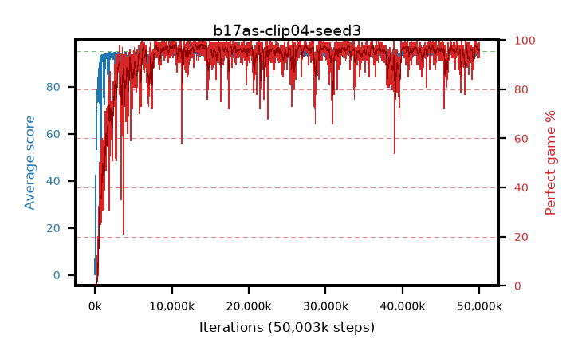

# b17as-clip04-seed3

step **50,003,968** · 3052 evals · trailing **94.2** · peak **94.52** @29,491,200 · sef **92.5** · best30 **97.8** @10,469,376

## Config

| | |
|---|---|
| algo | ppo |
| collect_envs | 128 |
| discount | 0.99 |
| eval_interval | 16384 |
| eval_queue | True |
| eval_queue_depth | 16 |
| eval_workers | 8 |
| fc_layers | (320,) |
| graph_eval_episodes | 100 |
| max_steps | 50003968 |
| min_checkpoint_score | 40.0 |
| ppo_adam_epsilon | 1e-07 |
| ppo_anneal_fraction | 1.0 |
| ppo_clip | 0.4 |
| ppo_clip_final | None |
| ppo_entropy_coef | 0.01 |
| ppo_entropy_coef_final | None |
| ppo_epochs | 4 |
| ppo_gae_lambda | 0.98 |
| ppo_gradient_clipping | 0.5 |
| ppo_horizon | 33.6 |
| ppo_learning_rate | 0.0003 |
| ppo_learning_rate_final | None |
| ppo_minibatch | 256 |
| ppo_normalize_adv | True |
| ppo_rollout | 128 |
| ppo_target_kl | 0.0 |
| ppo_transitions_per_rollout | 16384 |
| ppo_value_loss | huber |
| ppo_vf_coef | 0.5 |
| seed | 3 |
| torch_threads | 1 |

## Evals

| step | avg score | trailing avg | min score | max score | avg reward | perfect % | epsilon |
|---|---|---|---|---|---|---|---|
| 16384 | 0.17 | 0.17 | 0.0 | 2.0 | -0.384 | 0.0 |  |
| 32768 | 16.71 | 8.44 | 0.0 | 30.0 | 11.864 | 0.0 |  |
| 49152 | 23.08 | 13.32 | 11.0 | 39.0 | 18.1 | 0.0 |  |
| ... | ... | ... | ... | ... | ... | ... | ... |
| 49823744 | 94.07 | 94.27 | 12.0 | 95.0 | 190.784 | 98.0 |  |
| 49840128 | 93.59 | 94.18 | 12.0 | 95.0 | 187.311 | 95.0 |  |
| 49856512 | 94.38 | 94.2 | 72.0 | 95.0 | 189.083 | 96.0 |  |
| 49872896 | 94.71 | 94.19 | 73.0 | 95.0 | 191.412 | 98.0 |  |
| 49889280 | 94.55 | 94.18 | 79.0 | 95.0 | 188.245 | 95.0 |  |
| 49905664 | 93.93 | 94.15 | 48.0 | 95.0 | 188.559 | 96.0 |  |
| 49922048 | 94.7 | 94.19 | 65.0 | 95.0 | 192.354 | 99.0 |  |
| 49938432 | 94.3 | 94.19 | 69.0 | 95.0 | 185.965 | 93.0 |  |
| 49954816 | 94.32 | 94.13 | 64.0 | 95.0 | 187.018 | 94.0 |  |
| 49971200 | 94.61 | 94.21 | 56.0 | 95.0 | 192.266 | 99.0 |  |
| 49987584 | 92.93 | 94.14 | 26.0 | 95.0 | 186.563 | 95.0 |  |
| 50003968 | 94.93 | 94.2 | 90.0 | 95.0 | 191.627 | 98.0 |  |
