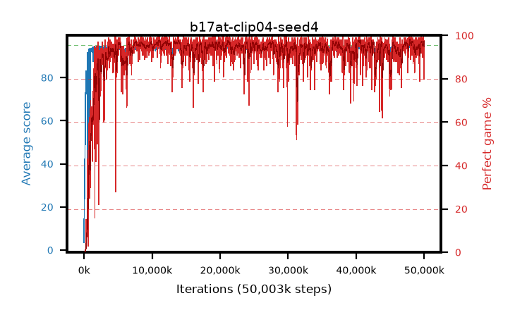

# b17at-clip04-seed4

step **50,003,968** · 3052 evals · trailing **94.14** · peak **94.49** @40,599,552 · sef **93.6** · best30 **97.2** @40,648,704

## Config

| | |
|---|---|
| algo | ppo |
| collect_envs | 128 |
| discount | 0.99 |
| eval_interval | 16384 |
| eval_queue | True |
| eval_queue_depth | 16 |
| eval_workers | 8 |
| fc_layers | (320,) |
| graph_eval_episodes | 100 |
| max_steps | 50003968 |
| min_checkpoint_score | 40.0 |
| ppo_adam_epsilon | 1e-07 |
| ppo_anneal_fraction | 1.0 |
| ppo_clip | 0.4 |
| ppo_clip_final | None |
| ppo_entropy_coef | 0.01 |
| ppo_entropy_coef_final | None |
| ppo_epochs | 4 |
| ppo_gae_lambda | 0.98 |
| ppo_gradient_clipping | 0.5 |
| ppo_horizon | 33.6 |
| ppo_learning_rate | 0.0003 |
| ppo_learning_rate_final | None |
| ppo_minibatch | 256 |
| ppo_normalize_adv | True |
| ppo_rollout | 128 |
| ppo_target_kl | 0.0 |
| ppo_transitions_per_rollout | 16384 |
| ppo_value_loss | huber |
| ppo_vf_coef | 0.5 |
| seed | 4 |
| torch_threads | 1 |

## Evals

| step | avg score | trailing avg | min score | max score | avg reward | perfect % | epsilon |
|---|---|---|---|---|---|---|---|
| 16384 | 3.54 | 3.54 | 1.0 | 10.0 | -0.786 | 0.0 |  |
| 32768 | 21.86 | 12.7 | 7.0 | 41.0 | 16.841 | 0.0 |  |
| 49152 | 24.42 | 16.61 | 6.0 | 47.0 | 19.396 | 0.0 |  |
| ... | ... | ... | ... | ... | ... | ... | ... |
| 49823744 | 93.87 | 94.0 | 25.0 | 95.0 | 190.553 | 98.0 |  |
| 49840128 | 94.29 | 94.04 | 66.0 | 95.0 | 189.996 | 97.0 |  |
| 49856512 | 94.79 | 94.26 | 74.0 | 95.0 | 192.506 | 99.0 |  |
| 49872896 | 94.77 | 94.22 | 72.0 | 95.0 | 192.492 | 99.0 |  |
| 49889280 | 94.19 | 94.14 | 14.0 | 95.0 | 191.898 | 99.0 |  |
| 49905664 | 95.0 | 94.21 | 95.0 | 95.0 | 193.713 | 100.0 |  |
| 49922048 | 94.6 | 94.19 | 60.0 | 95.0 | 191.276 | 98.0 |  |
| 49938432 | 93.84 | 94.22 | 20.0 | 95.0 | 188.566 | 96.0 |  |
| 49954816 | 93.44 | 94.25 | 18.0 | 95.0 | 189.074 | 97.0 |  |
| 49971200 | 93.03 | 94.2 | 42.0 | 95.0 | 180.673 | 89.0 |  |
| 49987584 | 91.91 | 94.13 | 59.0 | 95.0 | 170.617 | 80.0 |  |
| 50003968 | 94.07 | 94.14 | 79.0 | 95.0 | 183.702 | 91.0 |  |
