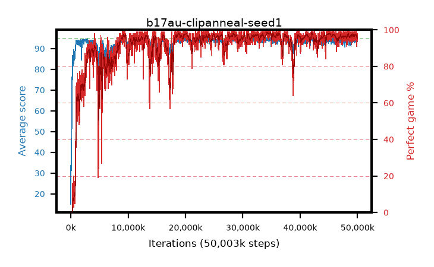

# b17au-clipanneal-seed1

step **50,003,968** · 3052 evals · trailing **93.99** · peak **94.59** @28,409,856 · sef **90.1** · best30 **98.2** @34,832,384

## Config

| | |
|---|---|
| algo | ppo |
| collect_envs | 128 |
| discount | 0.99 |
| eval_interval | 16384 |
| eval_queue | True |
| eval_queue_depth | 16 |
| eval_workers | 8 |
| fc_layers | (320,) |
| graph_eval_episodes | 100 |
| max_steps | 50003968 |
| min_checkpoint_score | 40.0 |
| ppo_adam_epsilon | 1e-07 |
| ppo_anneal_fraction | 1.0 |
| ppo_clip | 0.2 |
| ppo_clip_final | 0.02 |
| ppo_entropy_coef | 0.01 |
| ppo_entropy_coef_final | None |
| ppo_epochs | 4 |
| ppo_gae_lambda | 0.98 |
| ppo_gradient_clipping | 0.5 |
| ppo_horizon | 33.6 |
| ppo_learning_rate | 0.0003 |
| ppo_learning_rate_final | None |
| ppo_minibatch | 256 |
| ppo_normalize_adv | True |
| ppo_rollout | 128 |
| ppo_target_kl | 0.0 |
| ppo_transitions_per_rollout | 16384 |
| ppo_value_loss | huber |
| ppo_vf_coef | 0.5 |
| seed | 1 |
| torch_threads | 1 |

## Evals

| step | avg score | trailing avg | min score | max score | avg reward | perfect % | epsilon |
|---|---|---|---|---|---|---|---|
| 16384 | 15.02 | 29.7 | 1.0 | 36.0 | 13.118 | 0.0 |  |
| 32768 | 46.52 | 33.06 | 22.0 | 84.0 | 41.479 | 0.0 |  |
| 49152 | 37.12 | 37.12 | 16.0 | 73.0 | 32.03 | 0.0 |  |
| ... | ... | ... | ... | ... | ... | ... | ... |
| 49823744 | 93.1 | 94.0 | 8.0 | 95.0 | 185.836 | 94.0 |  |
| 49840128 | 94.48 | 94.05 | 67.0 | 95.0 | 190.202 | 97.0 |  |
| 49856512 | 94.61 | 94.06 | 61.0 | 95.0 | 191.334 | 98.0 |  |
| 49872896 | 91.88 | 93.94 | 14.0 | 95.0 | 181.623 | 91.0 |  |
| 49889280 | 94.76 | 93.94 | 84.0 | 95.0 | 190.478 | 97.0 |  |
| 49905664 | 93.62 | 94.03 | 5.0 | 95.0 | 189.356 | 97.0 |  |
| 49922048 | 94.06 | 93.94 | 47.0 | 95.0 | 187.786 | 95.0 |  |
| 49938432 | 94.27 | 94.05 | 63.0 | 95.0 | 188.999 | 96.0 |  |
| 49954816 | 93.96 | 94.06 | 57.0 | 95.0 | 186.68 | 94.0 |  |
| 49971200 | 94.18 | 94.01 | 52.0 | 95.0 | 190.905 | 98.0 |  |
| 49987584 | 93.54 | 94.03 | 57.0 | 95.0 | 186.26 | 94.0 |  |
| 50003968 | 93.32 | 93.99 | 30.0 | 95.0 | 186.044 | 94.0 |  |
