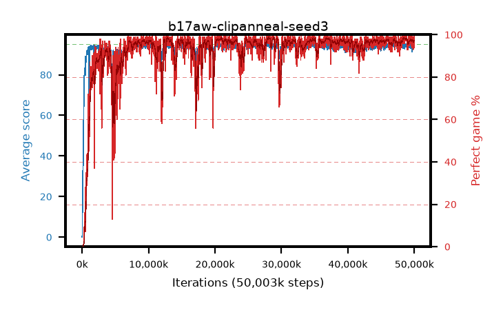

# b17aw-clipanneal-seed3

step **50,003,968** · 3052 evals · trailing **94.11** · peak **94.61** @28,164,096 · sef **93.2** · best30 **98.4** @28,180,480

## Config

| | |
|---|---|
| algo | ppo |
| collect_envs | 128 |
| discount | 0.99 |
| eval_interval | 16384 |
| eval_queue | True |
| eval_queue_depth | 16 |
| eval_workers | 8 |
| fc_layers | (320,) |
| graph_eval_episodes | 100 |
| max_steps | 50003968 |
| min_checkpoint_score | 40.0 |
| ppo_adam_epsilon | 1e-07 |
| ppo_anneal_fraction | 1.0 |
| ppo_clip | 0.2 |
| ppo_clip_final | 0.02 |
| ppo_entropy_coef | 0.01 |
| ppo_entropy_coef_final | None |
| ppo_epochs | 4 |
| ppo_gae_lambda | 0.98 |
| ppo_gradient_clipping | 0.5 |
| ppo_horizon | 33.6 |
| ppo_learning_rate | 0.0003 |
| ppo_learning_rate_final | None |
| ppo_minibatch | 256 |
| ppo_normalize_adv | True |
| ppo_rollout | 128 |
| ppo_target_kl | 0.0 |
| ppo_transitions_per_rollout | 16384 |
| ppo_value_loss | huber |
| ppo_vf_coef | 0.5 |
| seed | 3 |
| torch_threads | 1 |

## Evals

| step | avg score | trailing avg | min score | max score | avg reward | perfect % | epsilon |
|---|---|---|---|---|---|---|---|
| 16384 | 0.05 | 0.05 | 0.0 | 1.0 | -1.444 | 0.0 |  |
| 32768 | 1.14 | 0.59 | 0.0 | 3.0 | 0.578 | 0.0 |  |
| 49152 | 17.42 | 15.32 | 2.0 | 37.0 | 13.067 | 0.0 |  |
| ... | ... | ... | ... | ... | ... | ... | ... |
| 49823744 | 93.24 | 94.02 | 26.0 | 95.0 | 184.978 | 93.0 |  |
| 49840128 | 94.81 | 94.09 | 76.0 | 95.0 | 192.528 | 99.0 |  |
| 49856512 | 94.4 | 94.01 | 58.0 | 95.0 | 190.127 | 97.0 |  |
| 49872896 | 94.51 | 94.04 | 55.0 | 95.0 | 190.227 | 97.0 |  |
| 49889280 | 94.51 | 94.07 | 68.0 | 95.0 | 191.217 | 98.0 |  |
| 49905664 | 93.62 | 94.05 | 32.0 | 95.0 | 189.34 | 97.0 |  |
| 49922048 | 94.82 | 94.05 | 77.0 | 95.0 | 192.53 | 99.0 |  |
| 49938432 | 93.85 | 94.05 | 26.0 | 95.0 | 188.539 | 96.0 |  |
| 49954816 | 94.19 | 94.03 | 14.0 | 95.0 | 191.913 | 99.0 |  |
| 49971200 | 94.33 | 94.04 | 57.0 | 95.0 | 189.049 | 96.0 |  |
| 49987584 | 93.68 | 94.07 | 53.0 | 95.0 | 186.398 | 94.0 |  |
| 50003968 | 94.91 | 94.11 | 86.0 | 95.0 | 192.619 | 99.0 |  |
