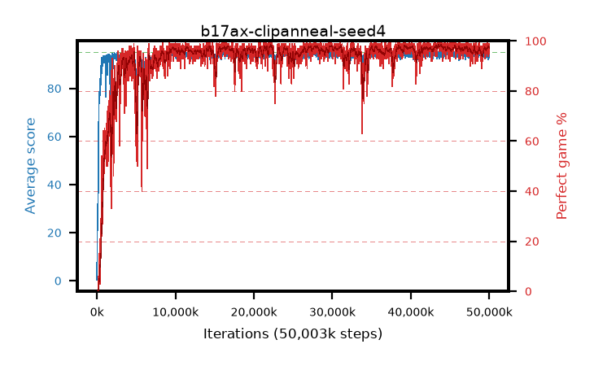

# b17ax-clipanneal-seed4

step **50,003,968** · 3052 evals · trailing **93.96** · peak **94.47** @44,924,928 · sef **93.9** · best30 **98.2** @43,810,816

## Config

| | |
|---|---|
| algo | ppo |
| collect_envs | 128 |
| discount | 0.99 |
| eval_interval | 16384 |
| eval_queue | True |
| eval_queue_depth | 16 |
| eval_workers | 8 |
| fc_layers | (320,) |
| graph_eval_episodes | 100 |
| max_steps | 50003968 |
| min_checkpoint_score | 40.0 |
| ppo_adam_epsilon | 1e-07 |
| ppo_anneal_fraction | 1.0 |
| ppo_clip | 0.2 |
| ppo_clip_final | 0.02 |
| ppo_entropy_coef | 0.01 |
| ppo_entropy_coef_final | None |
| ppo_epochs | 4 |
| ppo_gae_lambda | 0.98 |
| ppo_gradient_clipping | 0.5 |
| ppo_horizon | 33.6 |
| ppo_learning_rate | 0.0003 |
| ppo_learning_rate_final | None |
| ppo_minibatch | 256 |
| ppo_normalize_adv | True |
| ppo_rollout | 128 |
| ppo_target_kl | 0.0 |
| ppo_transitions_per_rollout | 16384 |
| ppo_value_loss | huber |
| ppo_vf_coef | 0.5 |
| seed | 4 |
| torch_threads | 1 |

## Evals

| step | avg score | trailing avg | min score | max score | avg reward | perfect % | epsilon |
|---|---|---|---|---|---|---|---|
| 16384 | 0.35 | 0.35 | 0.0 | 3.0 | -0.649 | 0.0 |  |
| 32768 | 16.98 | 17.66 | 2.0 | 37.0 | 12.249 | 0.0 |  |
| 49152 | 24.88 | 12.62 | 4.0 | 52.0 | 19.89 | 0.0 |  |
| ... | ... | ... | ... | ... | ... | ... | ... |
| 49823744 | 94.14 | 94.01 | 36.0 | 95.0 | 190.862 | 98.0 |  |
| 49840128 | 93.35 | 93.99 | 3.0 | 95.0 | 190.079 | 98.0 |  |
| 49856512 | 94.27 | 94.03 | 26.0 | 95.0 | 190.988 | 98.0 |  |
| 49872896 | 91.88 | 93.95 | 3.0 | 95.0 | 184.567 | 94.0 |  |
| 49889280 | 93.07 | 93.99 | 3.0 | 95.0 | 187.807 | 96.0 |  |
| 49905664 | 94.64 | 93.98 | 59.0 | 95.0 | 192.345 | 99.0 |  |
| 49922048 | 93.45 | 93.95 | 15.0 | 95.0 | 190.136 | 98.0 |  |
| 49938432 | 94.9 | 93.99 | 85.0 | 95.0 | 192.604 | 99.0 |  |
| 49954816 | 94.04 | 93.95 | 28.0 | 95.0 | 189.763 | 97.0 |  |
| 49971200 | 94.26 | 93.97 | 24.0 | 95.0 | 190.988 | 98.0 |  |
| 49987584 | 93.53 | 93.98 | 14.0 | 95.0 | 188.26 | 96.0 |  |
| 50003968 | 92.81 | 93.96 | 6.0 | 95.0 | 186.553 | 95.0 |  |
