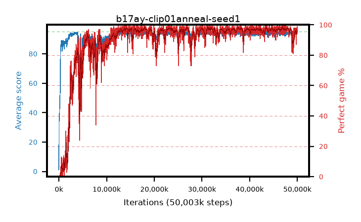

# b17ay-clip01anneal-seed1

step **50,003,968** · 3052 evals · trailing **94.18** · peak **94.42** @37,765,120 · sef **88.7** · best30 **98.0** @31,490,048

## Config

| | |
|---|---|
| algo | ppo |
| collect_envs | 128 |
| discount | 0.99 |
| eval_interval | 16384 |
| eval_queue | True |
| eval_queue_depth | 16 |
| eval_workers | 8 |
| fc_layers | (320,) |
| graph_eval_episodes | 100 |
| max_steps | 50003968 |
| min_checkpoint_score | 40.0 |
| ppo_adam_epsilon | 1e-07 |
| ppo_anneal_fraction | 1.0 |
| ppo_clip | 0.1 |
| ppo_clip_final | 0.02 |
| ppo_entropy_coef | 0.01 |
| ppo_entropy_coef_final | None |
| ppo_epochs | 4 |
| ppo_gae_lambda | 0.98 |
| ppo_gradient_clipping | 0.5 |
| ppo_horizon | 33.6 |
| ppo_learning_rate | 0.0003 |
| ppo_learning_rate_final | None |
| ppo_minibatch | 256 |
| ppo_normalize_adv | True |
| ppo_rollout | 128 |
| ppo_target_kl | 0.0 |
| ppo_transitions_per_rollout | 16384 |
| ppo_value_loss | huber |
| ppo_vf_coef | 0.5 |
| seed | 1 |
| torch_threads | 1 |

## Evals

| step | avg score | trailing avg | min score | max score | avg reward | perfect % | epsilon |
|---|---|---|---|---|---|---|---|
| 16384 | 1.15 | 1.15 | 0.0 | 3.0 | -3.815 | 0.0 |  |
| 32768 | 29.37 | 15.26 | 10.0 | 62.0 | 26.286 | 0.0 |  |
| 49152 | 36.81 | 22.44 | 13.0 | 61.0 | 31.718 | 0.0 |  |
| ... | ... | ... | ... | ... | ... | ... | ... |
| 49823744 | 93.91 | 93.96 | 62.0 | 95.0 | 186.641 | 94.0 |  |
| 49840128 | 94.2 | 94.05 | 61.0 | 95.0 | 186.921 | 94.0 |  |
| 49856512 | 94.38 | 93.89 | 76.0 | 95.0 | 188.115 | 95.0 |  |
| 49872896 | 94.86 | 94.13 | 87.0 | 95.0 | 190.575 | 97.0 |  |
| 49889280 | 93.58 | 94.02 | 58.0 | 95.0 | 186.273 | 94.0 |  |
| 49905664 | 93.78 | 94.17 | 6.0 | 95.0 | 188.498 | 96.0 |  |
| 49922048 | 94.85 | 94.19 | 85.0 | 95.0 | 191.569 | 98.0 |  |
| 49938432 | 94.91 | 94.21 | 88.0 | 95.0 | 191.629 | 98.0 |  |
| 49954816 | 94.62 | 94.14 | 72.0 | 95.0 | 191.344 | 98.0 |  |
| 49971200 | 94.65 | 94.16 | 60.0 | 95.0 | 192.369 | 99.0 |  |
| 49987584 | 94.54 | 94.19 | 75.0 | 95.0 | 189.27 | 96.0 |  |
| 50003968 | 93.99 | 94.18 | 6.0 | 95.0 | 189.713 | 97.0 |  |
