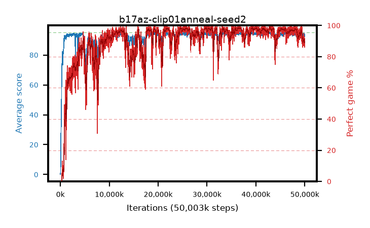

# b17az-clip01anneal-seed2

step **50,003,968** · 3052 evals · trailing **93.34** · peak **94.55** @43,204,608 · sef **85.6** · best30 **98.3** @36,683,776

## Config

| | |
|---|---|
| algo | ppo |
| collect_envs | 128 |
| discount | 0.99 |
| eval_interval | 16384 |
| eval_queue | True |
| eval_queue_depth | 16 |
| eval_workers | 8 |
| fc_layers | (320,) |
| graph_eval_episodes | 100 |
| max_steps | 50003968 |
| min_checkpoint_score | 40.0 |
| ppo_adam_epsilon | 1e-07 |
| ppo_anneal_fraction | 1.0 |
| ppo_clip | 0.1 |
| ppo_clip_final | 0.02 |
| ppo_entropy_coef | 0.01 |
| ppo_entropy_coef_final | None |
| ppo_epochs | 4 |
| ppo_gae_lambda | 0.98 |
| ppo_gradient_clipping | 0.5 |
| ppo_horizon | 33.6 |
| ppo_learning_rate | 0.0003 |
| ppo_learning_rate_final | None |
| ppo_minibatch | 256 |
| ppo_normalize_adv | True |
| ppo_rollout | 128 |
| ppo_target_kl | 0.0 |
| ppo_transitions_per_rollout | 16384 |
| ppo_value_loss | huber |
| ppo_vf_coef | 0.5 |
| seed | 2 |
| torch_threads | 1 |

## Evals

| step | avg score | trailing avg | min score | max score | avg reward | perfect % | epsilon |
|---|---|---|---|---|---|---|---|
| 16384 | 0.12 | 0.12 | 0.0 | 2.0 | -4.259 | 0.0 |  |
| 32768 | 1.78 | 0.95 | 0.0 | 6.0 | -0.471 | 0.0 |  |
| 49152 | 6.82 | 8.05 | 0.0 | 21.0 | 3.209 | 0.0 |  |
| ... | ... | ... | ... | ... | ... | ... | ... |
| 49823744 | 93.86 | 93.65 | 70.0 | 95.0 | 183.582 | 91.0 |  |
| 49840128 | 93.57 | 93.54 | 47.0 | 95.0 | 180.256 | 88.0 |  |
| 49856512 | 93.65 | 93.54 | 55.0 | 95.0 | 180.387 | 88.0 |  |
| 49872896 | 92.53 | 93.48 | 6.0 | 95.0 | 179.269 | 88.0 |  |
| 49889280 | 93.85 | 93.53 | 69.0 | 95.0 | 182.584 | 90.0 |  |
| 49905664 | 93.43 | 93.4 | 68.0 | 95.0 | 181.162 | 89.0 |  |
| 49922048 | 94.33 | 93.41 | 82.0 | 95.0 | 186.039 | 93.0 |  |
| 49938432 | 92.36 | 93.33 | 3.0 | 95.0 | 179.096 | 88.0 |  |
| 49954816 | 93.72 | 93.33 | 61.0 | 95.0 | 181.461 | 89.0 |  |
| 49971200 | 93.46 | 93.43 | 63.0 | 95.0 | 178.143 | 86.0 |  |
| 49987584 | 93.1 | 93.35 | 17.0 | 95.0 | 181.773 | 90.0 |  |
| 50003968 | 93.21 | 93.34 | 6.0 | 95.0 | 181.944 | 90.0 |  |
