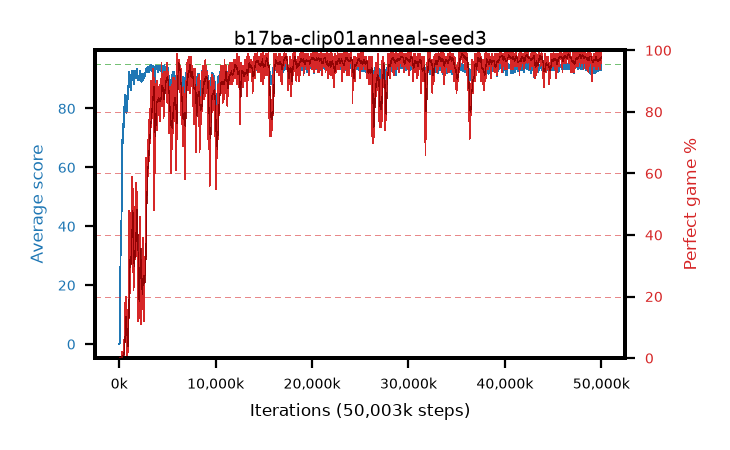

# b17ba-clip01anneal-seed3

step **50,003,968** · 3052 evals · trailing **94.01** · peak **94.51** @48,414,720 · sef **88.9** · best30 **98.2** @35,848,192

## Config

| | |
|---|---|
| algo | ppo |
| collect_envs | 128 |
| discount | 0.99 |
| eval_interval | 16384 |
| eval_queue | True |
| eval_queue_depth | 16 |
| eval_workers | 8 |
| fc_layers | (320,) |
| graph_eval_episodes | 100 |
| max_steps | 50003968 |
| min_checkpoint_score | 40.0 |
| ppo_adam_epsilon | 1e-07 |
| ppo_anneal_fraction | 1.0 |
| ppo_clip | 0.1 |
| ppo_clip_final | 0.02 |
| ppo_entropy_coef | 0.01 |
| ppo_entropy_coef_final | None |
| ppo_epochs | 4 |
| ppo_gae_lambda | 0.98 |
| ppo_gradient_clipping | 0.5 |
| ppo_horizon | 33.6 |
| ppo_learning_rate | 0.0003 |
| ppo_learning_rate_final | None |
| ppo_minibatch | 256 |
| ppo_normalize_adv | True |
| ppo_rollout | 128 |
| ppo_target_kl | 0.0 |
| ppo_transitions_per_rollout | 16384 |
| ppo_value_loss | huber |
| ppo_vf_coef | 0.5 |
| seed | 3 |
| torch_threads | 1 |

## Evals

| step | avg score | trailing avg | min score | max score | avg reward | perfect % | epsilon |
|---|---|---|---|---|---|---|---|
| 16384 | 0.0 | 0.0 | 0.0 | 0.0 | -5.001 | 0.0 |  |
| 32768 | 0.07 | 0.04 | 0.0 | 1.0 | -0.481 | 0.0 |  |
| 49152 | 0.18 | 0.08 | 0.0 | 2.0 | -0.372 | 0.0 |  |
| ... | ... | ... | ... | ... | ... | ... | ... |
| 49823744 | 94.04 | 93.92 | 61.0 | 95.0 | 187.757 | 95.0 |  |
| 49840128 | 94.64 | 93.96 | 59.0 | 95.0 | 192.34 | 99.0 |  |
| 49856512 | 94.93 | 93.89 | 88.0 | 95.0 | 192.643 | 99.0 |  |
| 49872896 | 93.72 | 93.86 | 20.0 | 95.0 | 187.447 | 95.0 |  |
| 49889280 | 92.9 | 93.88 | 12.0 | 95.0 | 185.621 | 94.0 |  |
| 49905664 | 95.0 | 93.92 | 95.0 | 95.0 | 193.691 | 100.0 |  |
| 49922048 | 93.79 | 93.9 | 16.0 | 95.0 | 190.496 | 98.0 |  |
| 49938432 | 95.0 | 93.94 | 95.0 | 95.0 | 193.705 | 100.0 |  |
| 49954816 | 93.1 | 93.93 | 3.0 | 95.0 | 188.809 | 97.0 |  |
| 49971200 | 94.37 | 93.9 | 32.0 | 95.0 | 192.071 | 99.0 |  |
| 49987584 | 94.35 | 93.96 | 56.0 | 95.0 | 190.067 | 97.0 |  |
| 50003968 | 94.5 | 94.01 | 70.0 | 95.0 | 189.217 | 96.0 |  |
