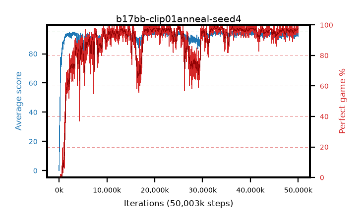

# b17bb-clip01anneal-seed4

step **50,003,968** · 3052 evals · trailing **93.47** · peak **94.48** @34,258,944 · sef **84.3** · best30 **98.3** @32,817,152

## Config

| | |
|---|---|
| algo | ppo |
| collect_envs | 128 |
| discount | 0.99 |
| eval_interval | 16384 |
| eval_queue | True |
| eval_queue_depth | 16 |
| eval_workers | 8 |
| fc_layers | (320,) |
| graph_eval_episodes | 100 |
| max_steps | 50003968 |
| min_checkpoint_score | 40.0 |
| ppo_adam_epsilon | 1e-07 |
| ppo_anneal_fraction | 1.0 |
| ppo_clip | 0.1 |
| ppo_clip_final | 0.02 |
| ppo_entropy_coef | 0.01 |
| ppo_entropy_coef_final | None |
| ppo_epochs | 4 |
| ppo_gae_lambda | 0.98 |
| ppo_gradient_clipping | 0.5 |
| ppo_horizon | 33.6 |
| ppo_learning_rate | 0.0003 |
| ppo_learning_rate_final | None |
| ppo_minibatch | 256 |
| ppo_normalize_adv | True |
| ppo_rollout | 128 |
| ppo_target_kl | 0.0 |
| ppo_transitions_per_rollout | 16384 |
| ppo_value_loss | huber |
| ppo_vf_coef | 0.5 |
| seed | 4 |
| torch_threads | 1 |

## Evals

| step | avg score | trailing avg | min score | max score | avg reward | perfect % | epsilon |
|---|---|---|---|---|---|---|---|
| 16384 | 0.04 | 0.04 | 0.0 | 2.0 | -3.049 | 0.0 |  |
| 32768 | 6.24 | 3.14 | 0.0 | 15.0 | 3.242 | 0.0 |  |
| 49152 | 18.7 | 8.33 | 1.0 | 39.0 | 14.19 | 0.0 |  |
| ... | ... | ... | ... | ... | ... | ... | ... |
| 49823744 | 94.85 | 93.13 | 80.0 | 95.0 | 192.56 | 99.0 |  |
| 49840128 | 94.15 | 93.17 | 15.0 | 95.0 | 190.885 | 98.0 |  |
| 49856512 | 94.27 | 93.28 | 61.0 | 95.0 | 190.011 | 97.0 |  |
| 49872896 | 93.98 | 93.21 | 13.0 | 95.0 | 190.707 | 98.0 |  |
| 49889280 | 94.88 | 93.34 | 85.0 | 95.0 | 191.601 | 98.0 |  |
| 49905664 | 93.77 | 93.4 | 5.0 | 95.0 | 189.494 | 97.0 |  |
| 49922048 | 93.78 | 93.53 | 33.0 | 95.0 | 189.502 | 97.0 |  |
| 49938432 | 94.08 | 93.51 | 3.0 | 95.0 | 191.817 | 99.0 |  |
| 49954816 | 93.85 | 93.4 | 17.0 | 95.0 | 189.593 | 97.0 |  |
| 49971200 | 93.94 | 93.46 | 7.0 | 95.0 | 189.66 | 97.0 |  |
| 49987584 | 91.87 | 93.47 | 6.0 | 95.0 | 185.622 | 95.0 |  |
| 50003968 | 94.55 | 93.47 | 68.0 | 95.0 | 191.267 | 98.0 |  |
