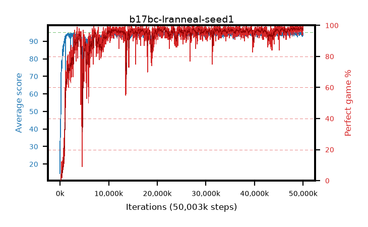

# b17bc-lranneal-seed1

step **50,003,968** · 3052 evals · trailing **94.42** · peak **94.57** @48,594,944 · sef **92.2** · best30 **98.2** @49,856,512

## Config

| | |
|---|---|
| algo | ppo |
| collect_envs | 128 |
| discount | 0.99 |
| eval_interval | 16384 |
| eval_queue | True |
| eval_queue_depth | 16 |
| eval_workers | 8 |
| fc_layers | (320,) |
| graph_eval_episodes | 100 |
| max_steps | 50003968 |
| min_checkpoint_score | 40.0 |
| ppo_adam_epsilon | 1e-07 |
| ppo_anneal_fraction | 1.0 |
| ppo_clip | 0.2 |
| ppo_clip_final | None |
| ppo_entropy_coef | 0.01 |
| ppo_entropy_coef_final | None |
| ppo_epochs | 4 |
| ppo_gae_lambda | 0.98 |
| ppo_gradient_clipping | 0.5 |
| ppo_horizon | 33.6 |
| ppo_learning_rate | 0.0003 |
| ppo_learning_rate_final | 0.0 |
| ppo_minibatch | 256 |
| ppo_normalize_adv | True |
| ppo_rollout | 128 |
| ppo_target_kl | 0.0 |
| ppo_transitions_per_rollout | 16384 |
| ppo_value_loss | huber |
| ppo_vf_coef | 0.5 |
| seed | 1 |
| torch_threads | 1 |

## Evals

| step | avg score | trailing avg | min score | max score | avg reward | perfect % | epsilon |
|---|---|---|---|---|---|---|---|
| 16384 | 14.59 | 14.59 | 1.0 | 33.0 | 12.828 | 0.0 |  |
| 32768 | 45.69 | 32.83 | 11.0 | 81.0 | 40.625 | 0.0 |  |
| 49152 | 37.99 | 34.12 | 1.0 | 82.0 | 32.976 | 0.0 |  |
| ... | ... | ... | ... | ... | ... | ... | ... |
| 49823744 | 95.0 | 94.54 | 95.0 | 95.0 | 193.698 | 100.0 |  |
| 49840128 | 94.59 | 94.53 | 56.0 | 95.0 | 191.293 | 98.0 |  |
| 49856512 | 94.97 | 94.55 | 92.0 | 95.0 | 192.673 | 99.0 |  |
| 49872896 | 94.43 | 94.53 | 59.0 | 95.0 | 191.139 | 98.0 |  |
| 49889280 | 92.76 | 94.41 | 6.0 | 95.0 | 185.467 | 94.0 |  |
| 49905664 | 94.27 | 94.53 | 60.0 | 95.0 | 189.983 | 97.0 |  |
| 49922048 | 92.98 | 94.49 | 6.0 | 95.0 | 187.698 | 96.0 |  |
| 49938432 | 94.05 | 94.39 | 16.0 | 95.0 | 189.76 | 97.0 |  |
| 49954816 | 94.98 | 94.43 | 93.0 | 95.0 | 192.675 | 99.0 |  |
| 49971200 | 94.67 | 94.54 | 62.0 | 95.0 | 192.386 | 99.0 |  |
| 49987584 | 94.56 | 94.41 | 72.0 | 95.0 | 190.27 | 97.0 |  |
| 50003968 | 94.35 | 94.42 | 32.0 | 95.0 | 191.057 | 98.0 |  |
