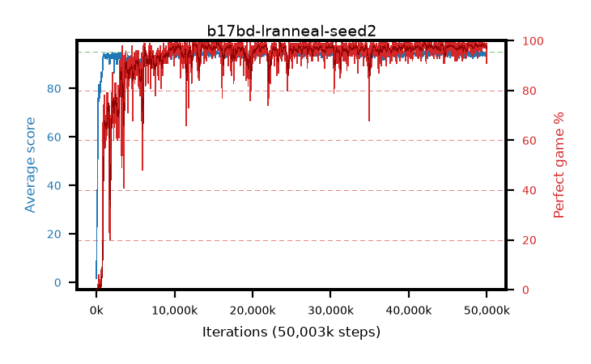

# b17bd-lranneal-seed2

step **50,003,968** · 3052 evals · trailing **94.24** · peak **94.61** @15,499,264 · sef **93.1** · best30 **98.6** @15,728,640

## Config

| | |
|---|---|
| algo | ppo |
| collect_envs | 128 |
| discount | 0.99 |
| eval_interval | 16384 |
| eval_queue | True |
| eval_queue_depth | 16 |
| eval_workers | 8 |
| fc_layers | (320,) |
| graph_eval_episodes | 100 |
| max_steps | 50003968 |
| min_checkpoint_score | 40.0 |
| ppo_adam_epsilon | 1e-07 |
| ppo_anneal_fraction | 1.0 |
| ppo_clip | 0.2 |
| ppo_clip_final | None |
| ppo_entropy_coef | 0.01 |
| ppo_entropy_coef_final | None |
| ppo_epochs | 4 |
| ppo_gae_lambda | 0.98 |
| ppo_gradient_clipping | 0.5 |
| ppo_horizon | 33.6 |
| ppo_learning_rate | 0.0003 |
| ppo_learning_rate_final | 0.0 |
| ppo_minibatch | 256 |
| ppo_normalize_adv | True |
| ppo_rollout | 128 |
| ppo_target_kl | 0.0 |
| ppo_transitions_per_rollout | 16384 |
| ppo_value_loss | huber |
| ppo_vf_coef | 0.5 |
| seed | 2 |
| torch_threads | 1 |

## Evals

| step | avg score | trailing avg | min score | max score | avg reward | perfect % | epsilon |
|---|---|---|---|---|---|---|---|
| 16384 | 1.64 | 1.64 | 0.0 | 4.0 | -0.784 | 0.0 |  |
| 32768 | 16.76 | 18.14 | 4.0 | 41.0 | 11.959 | 0.0 |  |
| 49152 | 26.87 | 14.26 | 6.0 | 49.0 | 21.821 | 0.0 |  |
| ... | ... | ... | ... | ... | ... | ... | ... |
| 49823744 | 94.09 | 94.34 | 38.0 | 95.0 | 190.807 | 98.0 |  |
| 49840128 | 93.76 | 94.27 | 28.0 | 95.0 | 189.477 | 97.0 |  |
| 49856512 | 94.87 | 94.29 | 86.0 | 95.0 | 191.57 | 98.0 |  |
| 49872896 | 94.7 | 94.35 | 73.0 | 95.0 | 190.416 | 97.0 |  |
| 49889280 | 93.77 | 94.36 | 4.0 | 95.0 | 189.491 | 97.0 |  |
| 49905664 | 94.62 | 94.28 | 64.0 | 95.0 | 191.335 | 98.0 |  |
| 49922048 | 94.61 | 94.31 | 58.0 | 95.0 | 191.325 | 98.0 |  |
| 49938432 | 94.8 | 94.34 | 75.0 | 95.0 | 192.511 | 99.0 |  |
| 49954816 | 92.94 | 94.25 | 20.0 | 95.0 | 187.681 | 96.0 |  |
| 49971200 | 94.7 | 94.24 | 74.0 | 95.0 | 190.406 | 97.0 |  |
| 49987584 | 92.11 | 94.19 | 10.0 | 95.0 | 181.789 | 91.0 |  |
| 50003968 | 93.68 | 94.24 | 34.0 | 95.0 | 189.401 | 97.0 |  |
