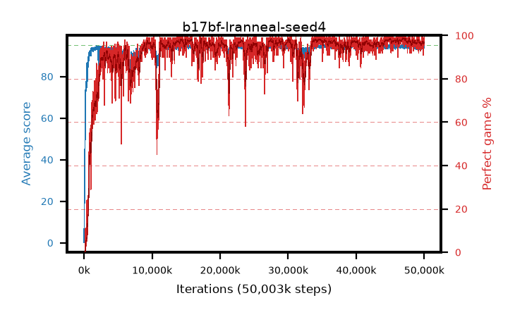

# b17bf-lranneal-seed4

step **50,003,968** · 3052 evals · trailing **94.33** · peak **94.66** @46,923,776 · sef **92.6** · best30 **98.3** @47,054,848

## Config

| | |
|---|---|
| algo | ppo |
| collect_envs | 128 |
| discount | 0.99 |
| eval_interval | 16384 |
| eval_queue | True |
| eval_queue_depth | 16 |
| eval_workers | 8 |
| fc_layers | (320,) |
| graph_eval_episodes | 100 |
| max_steps | 50003968 |
| min_checkpoint_score | 40.0 |
| ppo_adam_epsilon | 1e-07 |
| ppo_anneal_fraction | 1.0 |
| ppo_clip | 0.2 |
| ppo_clip_final | None |
| ppo_entropy_coef | 0.01 |
| ppo_entropy_coef_final | None |
| ppo_epochs | 4 |
| ppo_gae_lambda | 0.98 |
| ppo_gradient_clipping | 0.5 |
| ppo_horizon | 33.6 |
| ppo_learning_rate | 0.0003 |
| ppo_learning_rate_final | 0.0 |
| ppo_minibatch | 256 |
| ppo_normalize_adv | True |
| ppo_rollout | 128 |
| ppo_target_kl | 0.0 |
| ppo_transitions_per_rollout | 16384 |
| ppo_value_loss | huber |
| ppo_vf_coef | 0.5 |
| seed | 4 |
| torch_threads | 1 |

## Evals

| step | avg score | trailing avg | min score | max score | avg reward | perfect % | epsilon |
|---|---|---|---|---|---|---|---|
| 16384 | 0.2 | 0.2 | 0.0 | 1.0 | -0.483 | 0.0 |  |
| 32768 | 16.47 | 8.33 | 1.0 | 32.0 | 12.098 | 0.0 |  |
| 49152 | 22.79 | 13.15 | 5.0 | 45.0 | 17.755 | 0.0 |  |
| ... | ... | ... | ... | ... | ... | ... | ... |
| 49823744 | 94.29 | 94.22 | 61.0 | 95.0 | 190.002 | 97.0 |  |
| 49840128 | 94.89 | 94.23 | 84.0 | 95.0 | 192.597 | 99.0 |  |
| 49856512 | 94.93 | 94.24 | 88.0 | 95.0 | 192.633 | 99.0 |  |
| 49872896 | 93.68 | 94.22 | 52.0 | 95.0 | 183.404 | 91.0 |  |
| 49889280 | 94.11 | 94.2 | 61.0 | 95.0 | 189.827 | 97.0 |  |
| 49905664 | 94.55 | 94.18 | 72.0 | 95.0 | 190.265 | 97.0 |  |
| 49922048 | 93.4 | 94.16 | 10.0 | 95.0 | 187.07 | 95.0 |  |
| 49938432 | 94.72 | 94.26 | 83.0 | 95.0 | 189.429 | 96.0 |  |
| 49954816 | 94.58 | 94.19 | 53.0 | 95.0 | 192.3 | 99.0 |  |
| 49971200 | 94.75 | 94.26 | 76.0 | 95.0 | 191.455 | 98.0 |  |
| 49987584 | 94.97 | 94.29 | 92.0 | 95.0 | 192.669 | 99.0 |  |
| 50003968 | 94.98 | 94.33 | 93.0 | 95.0 | 192.684 | 99.0 |  |
