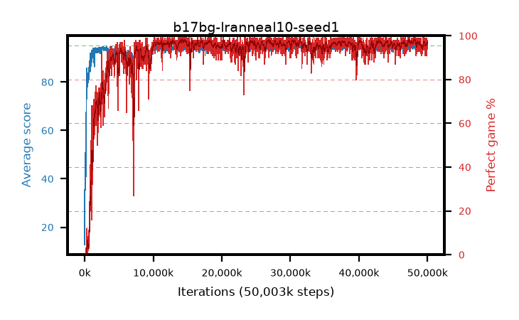

# b17bg-lranneal10-seed1

step **50,003,968** · 3052 evals · trailing **94.16** · peak **94.57** @31,408,128 · sef **93.0** · best30 **97.9** @14,270,464

## Config

| | |
|---|---|
| algo | ppo |
| collect_envs | 128 |
| discount | 0.99 |
| eval_interval | 16384 |
| eval_queue | True |
| eval_queue_depth | 16 |
| eval_workers | 8 |
| fc_layers | (320,) |
| graph_eval_episodes | 100 |
| max_steps | 50003968 |
| min_checkpoint_score | 40.0 |
| ppo_adam_epsilon | 1e-07 |
| ppo_anneal_fraction | 1.0 |
| ppo_clip | 0.2 |
| ppo_clip_final | None |
| ppo_entropy_coef | 0.01 |
| ppo_entropy_coef_final | None |
| ppo_epochs | 4 |
| ppo_gae_lambda | 0.98 |
| ppo_gradient_clipping | 0.5 |
| ppo_horizon | 33.6 |
| ppo_learning_rate | 0.0003 |
| ppo_learning_rate_final | 3e-05 |
| ppo_minibatch | 256 |
| ppo_normalize_adv | True |
| ppo_rollout | 128 |
| ppo_target_kl | 0.0 |
| ppo_transitions_per_rollout | 16384 |
| ppo_value_loss | huber |
| ppo_vf_coef | 0.5 |
| seed | 1 |
| torch_threads | 1 |

## Evals

| step | avg score | trailing avg | min score | max score | avg reward | perfect % | epsilon |
|---|---|---|---|---|---|---|---|
| 16384 | 12.77 | 30.14 | 1.0 | 44.0 | 11.333 | 0.0 |  |
| 32768 | 50.79 | 35.3 | 6.0 | 81.0 | 45.77 | 0.0 |  |
| 49152 | 41.4 | 38.83 | 6.0 | 80.0 | 36.327 | 0.0 |  |
| ... | ... | ... | ... | ... | ... | ... | ... |
| 49823744 | 93.44 | 94.17 | 63.0 | 95.0 | 183.162 | 91.0 |  |
| 49840128 | 94.75 | 94.18 | 70.0 | 95.0 | 192.448 | 99.0 |  |
| 49856512 | 94.15 | 94.18 | 61.0 | 95.0 | 189.86 | 97.0 |  |
| 49872896 | 94.96 | 94.18 | 93.0 | 95.0 | 191.67 | 98.0 |  |
| 49889280 | 93.94 | 94.16 | 60.0 | 95.0 | 187.662 | 95.0 |  |
| 49905664 | 94.67 | 94.18 | 62.0 | 95.0 | 192.391 | 99.0 |  |
| 49922048 | 93.81 | 94.16 | 10.0 | 95.0 | 190.524 | 98.0 |  |
| 49938432 | 94.37 | 94.14 | 42.0 | 95.0 | 189.086 | 96.0 |  |
| 49954816 | 94.21 | 94.18 | 22.0 | 95.0 | 189.883 | 97.0 |  |
| 49971200 | 94.57 | 94.15 | 56.0 | 95.0 | 191.303 | 98.0 |  |
| 49987584 | 94.51 | 94.16 | 75.0 | 95.0 | 188.238 | 95.0 |  |
| 50003968 | 93.66 | 94.16 | 34.0 | 95.0 | 189.388 | 97.0 |  |
