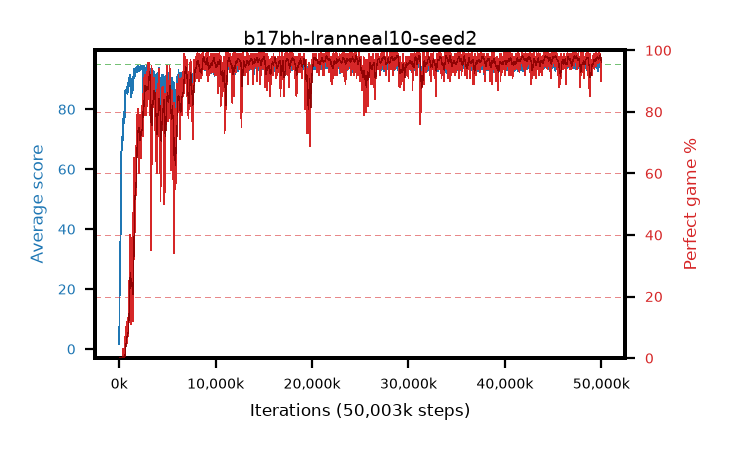

# b17bh-lranneal10-seed2

step **50,003,968** · 3052 evals · trailing **94.36** · peak **94.6** @31,178,752 · sef **92.0** · best30 **98.1** @45,285,376

## Config

| | |
|---|---|
| algo | ppo |
| collect_envs | 128 |
| discount | 0.99 |
| eval_interval | 16384 |
| eval_queue | True |
| eval_queue_depth | 16 |
| eval_workers | 8 |
| fc_layers | (320,) |
| graph_eval_episodes | 100 |
| max_steps | 50003968 |
| min_checkpoint_score | 40.0 |
| ppo_adam_epsilon | 1e-07 |
| ppo_anneal_fraction | 1.0 |
| ppo_clip | 0.2 |
| ppo_clip_final | None |
| ppo_entropy_coef | 0.01 |
| ppo_entropy_coef_final | None |
| ppo_epochs | 4 |
| ppo_gae_lambda | 0.98 |
| ppo_gradient_clipping | 0.5 |
| ppo_horizon | 33.6 |
| ppo_learning_rate | 0.0003 |
| ppo_learning_rate_final | 3e-05 |
| ppo_minibatch | 256 |
| ppo_normalize_adv | True |
| ppo_rollout | 128 |
| ppo_target_kl | 0.0 |
| ppo_transitions_per_rollout | 16384 |
| ppo_value_loss | huber |
| ppo_vf_coef | 0.5 |
| seed | 2 |
| torch_threads | 1 |

## Evals

| step | avg score | trailing avg | min score | max score | avg reward | perfect % | epsilon |
|---|---|---|---|---|---|---|---|
| 16384 | 1.63 | 1.63 | 0.0 | 5.0 | -0.974 | 0.0 |  |
| 32768 | 14.63 | 8.13 | 4.0 | 24.0 | 9.725 | 0.0 |  |
| 49152 | 20.83 | 12.36 | 0.0 | 41.0 | 16.106 | 0.0 |  |
| ... | ... | ... | ... | ... | ... | ... | ... |
| 49823744 | 94.21 | 94.4 | 51.0 | 95.0 | 190.864 | 98.0 |  |
| 49840128 | 94.78 | 94.4 | 85.0 | 95.0 | 190.491 | 97.0 |  |
| 49856512 | 94.97 | 94.37 | 92.0 | 95.0 | 192.679 | 99.0 |  |
| 49872896 | 94.78 | 94.36 | 84.0 | 95.0 | 190.489 | 97.0 |  |
| 49889280 | 94.93 | 94.34 | 88.0 | 95.0 | 192.643 | 99.0 |  |
| 49905664 | 94.63 | 94.37 | 67.0 | 95.0 | 191.346 | 98.0 |  |
| 49922048 | 93.82 | 94.35 | 26.0 | 95.0 | 188.547 | 96.0 |  |
| 49938432 | 94.66 | 94.4 | 68.0 | 95.0 | 190.374 | 97.0 |  |
| 49954816 | 94.73 | 94.35 | 82.0 | 95.0 | 190.439 | 97.0 |  |
| 49971200 | 93.51 | 94.37 | 62.0 | 95.0 | 184.253 | 92.0 |  |
| 49987584 | 94.63 | 94.34 | 80.0 | 95.0 | 189.328 | 96.0 |  |
| 50003968 | 93.31 | 94.36 | 63.0 | 95.0 | 182.033 | 90.0 |  |
