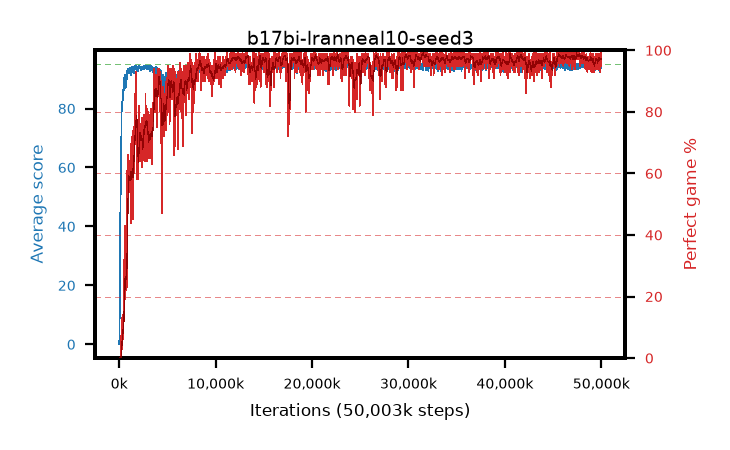

# b17bi-lranneal10-seed3

step **50,003,968** · 3052 evals · trailing **94.09** · peak **94.64** @29,868,032 · sef **92.0** · best30 **98.6** @47,759,360

## Config

| | |
|---|---|
| algo | ppo |
| collect_envs | 128 |
| discount | 0.99 |
| eval_interval | 16384 |
| eval_queue | True |
| eval_queue_depth | 16 |
| eval_workers | 8 |
| fc_layers | (320,) |
| graph_eval_episodes | 100 |
| max_steps | 50003968 |
| min_checkpoint_score | 40.0 |
| ppo_adam_epsilon | 1e-07 |
| ppo_anneal_fraction | 1.0 |
| ppo_clip | 0.2 |
| ppo_clip_final | None |
| ppo_entropy_coef | 0.01 |
| ppo_entropy_coef_final | None |
| ppo_epochs | 4 |
| ppo_gae_lambda | 0.98 |
| ppo_gradient_clipping | 0.5 |
| ppo_horizon | 33.6 |
| ppo_learning_rate | 0.0003 |
| ppo_learning_rate_final | 3e-05 |
| ppo_minibatch | 256 |
| ppo_normalize_adv | True |
| ppo_rollout | 128 |
| ppo_target_kl | 0.0 |
| ppo_transitions_per_rollout | 16384 |
| ppo_value_loss | huber |
| ppo_vf_coef | 0.5 |
| seed | 3 |
| torch_threads | 1 |

## Evals

| step | avg score | trailing avg | min score | max score | avg reward | perfect % | epsilon |
|---|---|---|---|---|---|---|---|
| 16384 | 0.07 | 0.07 | 0.0 | 1.0 | -2.404 | 0.0 |  |
| 32768 | 2.2 | 1.14 | 0.0 | 11.0 | 1.186 | 0.0 |  |
| 49152 | 16.11 | 6.13 | 0.0 | 32.0 | 11.738 | 0.0 |  |
| ... | ... | ... | ... | ... | ... | ... | ... |
| 49823744 | 94.17 | 94.14 | 63.0 | 95.0 | 188.89 | 96.0 |  |
| 49840128 | 94.48 | 94.2 | 61.0 | 95.0 | 190.199 | 97.0 |  |
| 49856512 | 94.09 | 94.13 | 57.0 | 95.0 | 189.756 | 97.0 |  |
| 49872896 | 94.64 | 94.08 | 59.0 | 95.0 | 192.363 | 99.0 |  |
| 49889280 | 94.49 | 94.15 | 52.0 | 95.0 | 191.147 | 98.0 |  |
| 49905664 | 92.23 | 94.11 | 8.0 | 95.0 | 183.966 | 93.0 |  |
| 49922048 | 94.8 | 94.13 | 75.0 | 95.0 | 192.517 | 99.0 |  |
| 49938432 | 93.88 | 94.11 | 10.0 | 95.0 | 189.593 | 97.0 |  |
| 49954816 | 94.3 | 94.13 | 63.0 | 95.0 | 190.023 | 97.0 |  |
| 49971200 | 95.0 | 94.18 | 95.0 | 95.0 | 193.714 | 100.0 |  |
| 49987584 | 93.68 | 94.16 | 54.0 | 95.0 | 187.406 | 95.0 |  |
| 50003968 | 94.17 | 94.09 | 60.0 | 95.0 | 189.895 | 97.0 |  |
