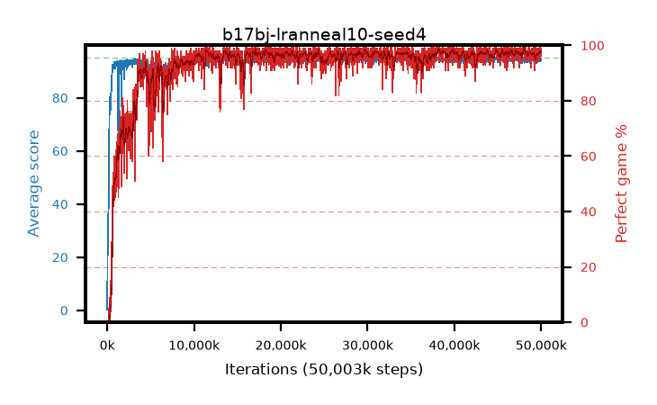

# b17bj-lranneal10-seed4

step **50,003,968** · 3052 evals · trailing **94.46** · peak **94.63** @39,993,344 · sef **92.6** · best30 **98.1** @48,250,880

## Config

| | |
|---|---|
| algo | ppo |
| collect_envs | 128 |
| discount | 0.99 |
| eval_interval | 16384 |
| eval_queue | True |
| eval_queue_depth | 16 |
| eval_workers | 8 |
| fc_layers | (320,) |
| graph_eval_episodes | 100 |
| max_steps | 50003968 |
| min_checkpoint_score | 40.0 |
| ppo_adam_epsilon | 1e-07 |
| ppo_anneal_fraction | 1.0 |
| ppo_clip | 0.2 |
| ppo_clip_final | None |
| ppo_entropy_coef | 0.01 |
| ppo_entropy_coef_final | None |
| ppo_epochs | 4 |
| ppo_gae_lambda | 0.98 |
| ppo_gradient_clipping | 0.5 |
| ppo_horizon | 33.6 |
| ppo_learning_rate | 0.0003 |
| ppo_learning_rate_final | 3e-05 |
| ppo_minibatch | 256 |
| ppo_normalize_adv | True |
| ppo_rollout | 128 |
| ppo_target_kl | 0.0 |
| ppo_transitions_per_rollout | 16384 |
| ppo_value_loss | huber |
| ppo_vf_coef | 0.5 |
| seed | 4 |
| torch_threads | 1 |

## Evals

| step | avg score | trailing avg | min score | max score | avg reward | perfect % | epsilon |
|---|---|---|---|---|---|---|---|
| 16384 | 0.25 | 0.25 | 0.0 | 2.0 | -0.613 | 0.0 |  |
| 32768 | 18.01 | 13.54 | 2.0 | 40.0 | 13.444 | 0.0 |  |
| 49152 | 22.36 | 11.3 | 3.0 | 42.0 | 17.325 | 0.0 |  |
| ... | ... | ... | ... | ... | ... | ... | ... |
| 49823744 | 94.62 | 94.25 | 65.0 | 95.0 | 191.329 | 98.0 |  |
| 49840128 | 94.49 | 94.28 | 68.0 | 95.0 | 191.19 | 98.0 |  |
| 49856512 | 94.68 | 94.14 | 63.0 | 95.0 | 192.393 | 99.0 |  |
| 49872896 | 94.84 | 94.35 | 89.0 | 95.0 | 190.566 | 97.0 |  |
| 49889280 | 95.0 | 94.18 | 95.0 | 95.0 | 193.715 | 100.0 |  |
| 49905664 | 94.51 | 94.31 | 67.0 | 95.0 | 188.234 | 95.0 |  |
| 49922048 | 94.59 | 94.29 | 73.0 | 95.0 | 191.311 | 98.0 |  |
| 49938432 | 93.85 | 94.33 | 32.0 | 95.0 | 188.56 | 96.0 |  |
| 49954816 | 94.93 | 94.38 | 88.0 | 95.0 | 192.625 | 99.0 |  |
| 49971200 | 94.64 | 94.43 | 61.0 | 95.0 | 191.347 | 98.0 |  |
| 49987584 | 94.95 | 94.44 | 90.0 | 95.0 | 192.666 | 99.0 |  |
| 50003968 | 94.73 | 94.46 | 75.0 | 95.0 | 190.449 | 97.0 |  |
