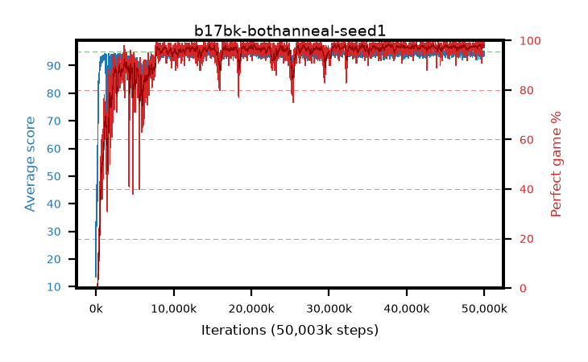

# b17bk-bothanneal-seed1

step **50,003,968** · 3052 evals · trailing **94.3** · peak **94.53** @45,383,680 · sef **94.6** · best30 **98.2** @37,797,888

## Config

| | |
|---|---|
| algo | ppo |
| collect_envs | 128 |
| discount | 0.99 |
| eval_interval | 16384 |
| eval_queue | True |
| eval_queue_depth | 16 |
| eval_workers | 8 |
| fc_layers | (320,) |
| graph_eval_episodes | 100 |
| max_steps | 50003968 |
| min_checkpoint_score | 40.0 |
| ppo_adam_epsilon | 1e-07 |
| ppo_anneal_fraction | 1.0 |
| ppo_clip | 0.2 |
| ppo_clip_final | 0.02 |
| ppo_entropy_coef | 0.01 |
| ppo_entropy_coef_final | None |
| ppo_epochs | 4 |
| ppo_gae_lambda | 0.98 |
| ppo_gradient_clipping | 0.5 |
| ppo_horizon | 33.6 |
| ppo_learning_rate | 0.0003 |
| ppo_learning_rate_final | 0.0 |
| ppo_minibatch | 256 |
| ppo_normalize_adv | True |
| ppo_rollout | 128 |
| ppo_target_kl | 0.0 |
| ppo_transitions_per_rollout | 16384 |
| ppo_value_loss | huber |
| ppo_vf_coef | 0.5 |
| seed | 1 |
| torch_threads | 1 |

## Evals

| step | avg score | trailing avg | min score | max score | avg reward | perfect % | epsilon |
|---|---|---|---|---|---|---|---|
| 16384 | 13.55 | 13.55 | 1.0 | 35.0 | 11.702 | 0.0 |  |
| 32768 | 46.77 | 33.94 | 7.0 | 84.0 | 41.637 | 0.0 |  |
| 49152 | 40.14 | 26.84 | 18.0 | 71.0 | 35.036 | 0.0 |  |
| ... | ... | ... | ... | ... | ... | ... | ... |
| 49823744 | 94.36 | 94.15 | 62.0 | 95.0 | 191.07 | 98.0 |  |
| 49840128 | 94.73 | 94.18 | 70.0 | 95.0 | 191.425 | 98.0 |  |
| 49856512 | 94.7 | 94.13 | 65.0 | 95.0 | 192.398 | 99.0 |  |
| 49872896 | 94.51 | 94.2 | 70.0 | 95.0 | 191.225 | 98.0 |  |
| 49889280 | 94.44 | 94.27 | 62.0 | 95.0 | 190.141 | 97.0 |  |
| 49905664 | 93.3 | 94.23 | 10.0 | 95.0 | 190.015 | 98.0 |  |
| 49922048 | 94.07 | 94.27 | 24.0 | 95.0 | 190.777 | 98.0 |  |
| 49938432 | 94.43 | 94.27 | 63.0 | 95.0 | 191.144 | 98.0 |  |
| 49954816 | 93.56 | 94.23 | 6.0 | 95.0 | 189.277 | 97.0 |  |
| 49971200 | 94.98 | 94.26 | 93.0 | 95.0 | 192.685 | 99.0 |  |
| 49987584 | 94.64 | 94.28 | 75.0 | 95.0 | 190.361 | 97.0 |  |
| 50003968 | 95.0 | 94.3 | 95.0 | 95.0 | 193.709 | 100.0 |  |
