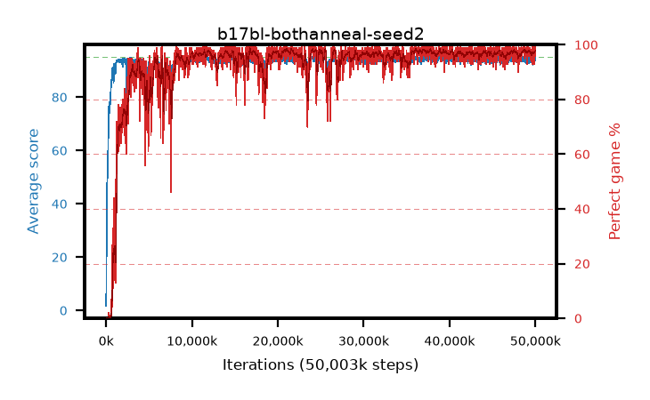

# b17bl-bothanneal-seed2

step **50,003,968** · 3052 evals · trailing **94.24** · peak **94.6** @37,748,736 · sef **93.3** · best30 **98.1** @24,395,776

## Config

| | |
|---|---|
| algo | ppo |
| collect_envs | 128 |
| discount | 0.99 |
| eval_interval | 16384 |
| eval_queue | True |
| eval_queue_depth | 16 |
| eval_workers | 8 |
| fc_layers | (320,) |
| graph_eval_episodes | 100 |
| max_steps | 50003968 |
| min_checkpoint_score | 40.0 |
| ppo_adam_epsilon | 1e-07 |
| ppo_anneal_fraction | 1.0 |
| ppo_clip | 0.2 |
| ppo_clip_final | 0.02 |
| ppo_entropy_coef | 0.01 |
| ppo_entropy_coef_final | None |
| ppo_epochs | 4 |
| ppo_gae_lambda | 0.98 |
| ppo_gradient_clipping | 0.5 |
| ppo_horizon | 33.6 |
| ppo_learning_rate | 0.0003 |
| ppo_learning_rate_final | 0.0 |
| ppo_minibatch | 256 |
| ppo_normalize_adv | True |
| ppo_rollout | 128 |
| ppo_target_kl | 0.0 |
| ppo_transitions_per_rollout | 16384 |
| ppo_value_loss | huber |
| ppo_vf_coef | 0.5 |
| seed | 2 |
| torch_threads | 1 |

## Evals

| step | avg score | trailing avg | min score | max score | avg reward | perfect % | epsilon |
|---|---|---|---|---|---|---|---|
| 16384 | 1.72 | 1.72 | 0.0 | 5.0 | -1.065 | 0.0 |  |
| 32768 | 9.31 | 5.52 | 0.0 | 22.0 | 5.647 | 0.0 |  |
| 49152 | 25.75 | 12.26 | 9.0 | 48.0 | 20.71 | 0.0 |  |
| ... | ... | ... | ... | ... | ... | ... | ... |
| 49823744 | 93.5 | 94.13 | 12.0 | 95.0 | 189.228 | 97.0 |  |
| 49840128 | 92.69 | 94.04 | 8.0 | 95.0 | 184.41 | 93.0 |  |
| 49856512 | 94.3 | 94.05 | 65.0 | 95.0 | 188.011 | 95.0 |  |
| 49872896 | 93.83 | 94.05 | 12.0 | 95.0 | 190.542 | 98.0 |  |
| 49889280 | 94.7 | 94.06 | 65.0 | 95.0 | 192.415 | 99.0 |  |
| 49905664 | 94.91 | 94.11 | 86.0 | 95.0 | 192.62 | 99.0 |  |
| 49922048 | 94.42 | 94.18 | 61.0 | 95.0 | 191.131 | 98.0 |  |
| 49938432 | 95.0 | 94.11 | 95.0 | 95.0 | 193.713 | 100.0 |  |
| 49954816 | 95.0 | 94.17 | 95.0 | 95.0 | 193.703 | 100.0 |  |
| 49971200 | 93.78 | 94.18 | 10.0 | 95.0 | 189.508 | 97.0 |  |
| 49987584 | 94.48 | 94.22 | 64.0 | 95.0 | 191.194 | 98.0 |  |
| 50003968 | 94.29 | 94.24 | 70.0 | 95.0 | 188.99 | 96.0 |  |
