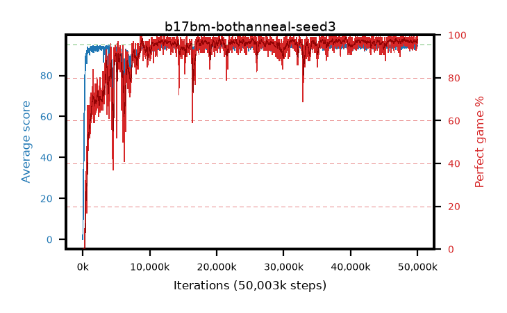

# b17bm-bothanneal-seed3

step **50,003,968** · 3052 evals · trailing **94.2** · peak **94.5** @35,733,504 · sef **90.5** · best30 **98.1** @39,387,136

## Config

| | |
|---|---|
| algo | ppo |
| collect_envs | 128 |
| discount | 0.99 |
| eval_interval | 16384 |
| eval_queue | True |
| eval_queue_depth | 16 |
| eval_workers | 8 |
| fc_layers | (320,) |
| graph_eval_episodes | 100 |
| max_steps | 50003968 |
| min_checkpoint_score | 40.0 |
| ppo_adam_epsilon | 1e-07 |
| ppo_anneal_fraction | 1.0 |
| ppo_clip | 0.2 |
| ppo_clip_final | 0.02 |
| ppo_entropy_coef | 0.01 |
| ppo_entropy_coef_final | None |
| ppo_epochs | 4 |
| ppo_gae_lambda | 0.98 |
| ppo_gradient_clipping | 0.5 |
| ppo_horizon | 33.6 |
| ppo_learning_rate | 0.0003 |
| ppo_learning_rate_final | 0.0 |
| ppo_minibatch | 256 |
| ppo_normalize_adv | True |
| ppo_rollout | 128 |
| ppo_target_kl | 0.0 |
| ppo_transitions_per_rollout | 16384 |
| ppo_value_loss | huber |
| ppo_vf_coef | 0.5 |
| seed | 3 |
| torch_threads | 1 |

## Evals

| step | avg score | trailing avg | min score | max score | avg reward | perfect % | epsilon |
|---|---|---|---|---|---|---|---|
| 16384 | 0.02 | 0.02 | 0.0 | 1.0 | -4.136 | 0.0 |  |
| 32768 | 3.78 | 1.9 | 0.0 | 13.0 | 2.724 | 0.0 |  |
| 49152 | 17.17 | 6.99 | 0.0 | 38.0 | 12.957 | 0.0 |  |
| ... | ... | ... | ... | ... | ... | ... | ... |
| 49823744 | 94.21 | 94.13 | 16.0 | 95.0 | 191.911 | 99.0 |  |
| 49840128 | 94.79 | 94.19 | 78.0 | 95.0 | 191.5 | 98.0 |  |
| 49856512 | 93.77 | 94.14 | 62.0 | 95.0 | 186.495 | 94.0 |  |
| 49872896 | 94.68 | 94.15 | 70.0 | 95.0 | 191.39 | 98.0 |  |
| 49889280 | 95.0 | 94.13 | 95.0 | 95.0 | 193.704 | 100.0 |  |
| 49905664 | 94.96 | 94.18 | 91.0 | 95.0 | 192.662 | 99.0 |  |
| 49922048 | 94.7 | 94.23 | 71.0 | 95.0 | 190.415 | 97.0 |  |
| 49938432 | 94.4 | 94.19 | 70.0 | 95.0 | 189.121 | 96.0 |  |
| 49954816 | 94.23 | 94.13 | 18.0 | 95.0 | 191.905 | 99.0 |  |
| 49971200 | 94.67 | 94.14 | 62.0 | 95.0 | 192.379 | 99.0 |  |
| 49987584 | 94.81 | 94.25 | 83.0 | 95.0 | 191.529 | 98.0 |  |
| 50003968 | 94.86 | 94.2 | 81.0 | 95.0 | 192.566 | 99.0 |  |
