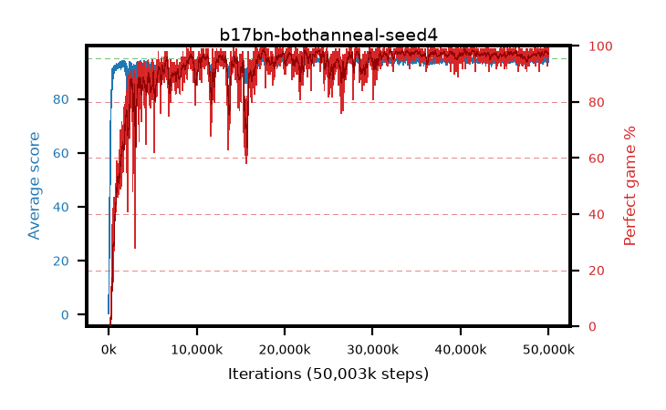

# b17bn-bothanneal-seed4

step **50,003,968** · 3052 evals · trailing **94.38** · peak **94.57** @41,484,288 · sef **92.9** · best30 **98.2** @41,615,360

## Config

| | |
|---|---|
| algo | ppo |
| collect_envs | 128 |
| discount | 0.99 |
| eval_interval | 16384 |
| eval_queue | True |
| eval_queue_depth | 16 |
| eval_workers | 8 |
| fc_layers | (320,) |
| graph_eval_episodes | 100 |
| max_steps | 50003968 |
| min_checkpoint_score | 40.0 |
| ppo_adam_epsilon | 1e-07 |
| ppo_anneal_fraction | 1.0 |
| ppo_clip | 0.2 |
| ppo_clip_final | 0.02 |
| ppo_entropy_coef | 0.01 |
| ppo_entropy_coef_final | None |
| ppo_epochs | 4 |
| ppo_gae_lambda | 0.98 |
| ppo_gradient_clipping | 0.5 |
| ppo_horizon | 33.6 |
| ppo_learning_rate | 0.0003 |
| ppo_learning_rate_final | 0.0 |
| ppo_minibatch | 256 |
| ppo_normalize_adv | True |
| ppo_rollout | 128 |
| ppo_target_kl | 0.0 |
| ppo_transitions_per_rollout | 16384 |
| ppo_value_loss | huber |
| ppo_vf_coef | 0.5 |
| seed | 4 |
| torch_threads | 1 |

## Evals

| step | avg score | trailing avg | min score | max score | avg reward | perfect % | epsilon |
|---|---|---|---|---|---|---|---|
| 16384 | 0.4 | 0.4 | 0.0 | 4.0 | -0.424 | 0.0 |  |
| 32768 | 17.73 | 9.06 | 1.0 | 36.0 | 13.657 | 0.0 |  |
| 49152 | 24.74 | 14.29 | 10.0 | 45.0 | 19.704 | 0.0 |  |
| ... | ... | ... | ... | ... | ... | ... | ... |
| 49823744 | 95.0 | 94.38 | 95.0 | 95.0 | 193.713 | 100.0 |  |
| 49840128 | 94.71 | 94.35 | 72.0 | 95.0 | 191.427 | 98.0 |  |
| 49856512 | 93.65 | 94.34 | 63.0 | 95.0 | 185.384 | 93.0 |  |
| 49872896 | 94.06 | 94.36 | 6.0 | 95.0 | 190.765 | 98.0 |  |
| 49889280 | 93.91 | 94.38 | 22.0 | 95.0 | 189.638 | 97.0 |  |
| 49905664 | 94.77 | 94.39 | 82.0 | 95.0 | 190.477 | 97.0 |  |
| 49922048 | 94.83 | 94.36 | 87.0 | 95.0 | 190.543 | 97.0 |  |
| 49938432 | 94.27 | 94.39 | 62.0 | 95.0 | 189.98 | 97.0 |  |
| 49954816 | 93.8 | 94.39 | 54.0 | 95.0 | 188.515 | 96.0 |  |
| 49971200 | 94.97 | 94.41 | 92.0 | 95.0 | 192.68 | 99.0 |  |
| 49987584 | 94.98 | 94.41 | 93.0 | 95.0 | 192.676 | 99.0 |  |
| 50003968 | 94.17 | 94.38 | 28.0 | 95.0 | 189.888 | 97.0 |  |
