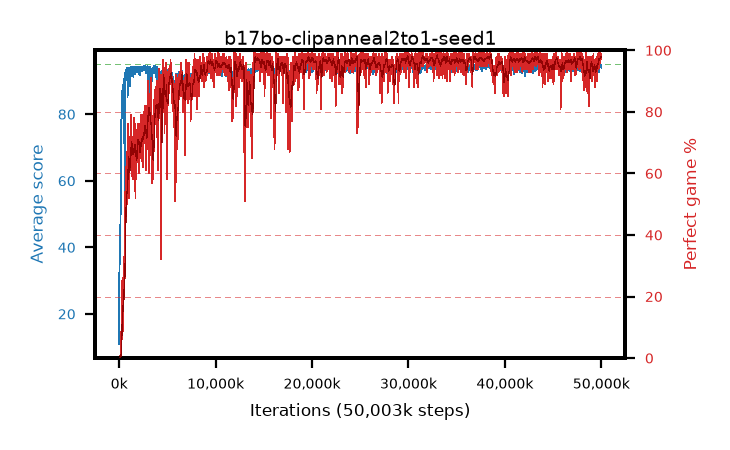

# b17bo-clipanneal2to1-seed1

step **50,003,968** · 3052 evals · trailing **94.26** · peak **94.51** @38,682,624 · sef **91.1** · best30 **97.9** @38,567,936

## Config

| | |
|---|---|
| algo | ppo |
| collect_envs | 128 |
| discount | 0.99 |
| eval_interval | 16384 |
| eval_queue | True |
| eval_queue_depth | 16 |
| eval_workers | 8 |
| fc_layers | (320,) |
| graph_eval_episodes | 100 |
| max_steps | 50003968 |
| min_checkpoint_score | 40.0 |
| ppo_adam_epsilon | 1e-07 |
| ppo_anneal_fraction | 1.0 |
| ppo_clip | 0.2 |
| ppo_clip_final | 0.1 |
| ppo_entropy_coef | 0.01 |
| ppo_entropy_coef_final | None |
| ppo_epochs | 4 |
| ppo_gae_lambda | 0.98 |
| ppo_gradient_clipping | 0.5 |
| ppo_horizon | 33.6 |
| ppo_learning_rate | 0.0003 |
| ppo_learning_rate_final | None |
| ppo_minibatch | 256 |
| ppo_normalize_adv | True |
| ppo_rollout | 128 |
| ppo_target_kl | 0.0 |
| ppo_transitions_per_rollout | 16384 |
| ppo_value_loss | huber |
| ppo_vf_coef | 0.5 |
| seed | 1 |
| torch_threads | 1 |

## Evals

| step | avg score | trailing avg | min score | max score | avg reward | perfect % | epsilon |
|---|---|---|---|---|---|---|---|
| 16384 | 10.93 | 30.55 | 1.0 | 38.0 | 9.465 | 0.0 |  |
| 32768 | 46.74 | 35.61 | 17.0 | 92.0 | 41.821 | 0.0 |  |
| 49152 | 36.51 | 35.72 | 10.0 | 70.0 | 31.415 | 0.0 |  |
| ... | ... | ... | ... | ... | ... | ... | ... |
| 49823744 | 94.88 | 93.96 | 83.0 | 95.0 | 192.597 | 99.0 |  |
| 49840128 | 94.68 | 93.99 | 80.0 | 95.0 | 190.404 | 97.0 |  |
| 49856512 | 95.0 | 93.93 | 95.0 | 95.0 | 193.701 | 100.0 |  |
| 49872896 | 94.77 | 94.09 | 72.0 | 95.0 | 192.469 | 99.0 |  |
| 49889280 | 94.51 | 94.19 | 62.0 | 95.0 | 191.217 | 98.0 |  |
| 49905664 | 94.37 | 94.29 | 59.0 | 95.0 | 189.082 | 96.0 |  |
| 49922048 | 94.44 | 94.12 | 72.0 | 95.0 | 190.111 | 97.0 |  |
| 49938432 | 94.27 | 94.25 | 69.0 | 95.0 | 189.981 | 97.0 |  |
| 49954816 | 94.27 | 94.2 | 56.0 | 95.0 | 190.981 | 98.0 |  |
| 49971200 | 94.77 | 94.27 | 72.0 | 95.0 | 192.488 | 99.0 |  |
| 49987584 | 94.11 | 94.26 | 20.0 | 95.0 | 189.829 | 97.0 |  |
| 50003968 | 94.01 | 94.26 | 7.0 | 95.0 | 189.735 | 97.0 |  |
