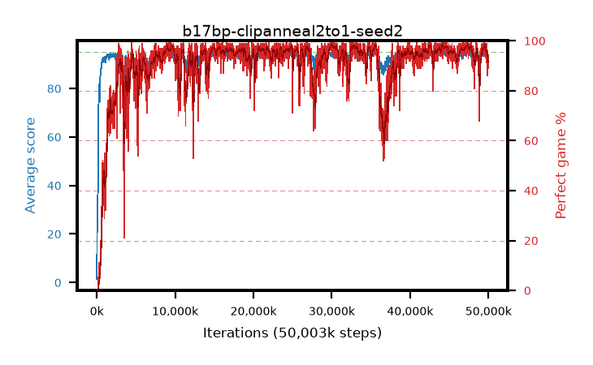

# b17bp-clipanneal2to1-seed2

step **50,003,968** · 3052 evals · trailing **93.86** · peak **94.6** @44,351,488 · sef **89.0** · best30 **98.0** @30,097,408

## Config

| | |
|---|---|
| algo | ppo |
| collect_envs | 128 |
| discount | 0.99 |
| eval_interval | 16384 |
| eval_queue | True |
| eval_queue_depth | 16 |
| eval_workers | 8 |
| fc_layers | (320,) |
| graph_eval_episodes | 100 |
| max_steps | 50003968 |
| min_checkpoint_score | 40.0 |
| ppo_adam_epsilon | 1e-07 |
| ppo_anneal_fraction | 1.0 |
| ppo_clip | 0.2 |
| ppo_clip_final | 0.1 |
| ppo_entropy_coef | 0.01 |
| ppo_entropy_coef_final | None |
| ppo_epochs | 4 |
| ppo_gae_lambda | 0.98 |
| ppo_gradient_clipping | 0.5 |
| ppo_horizon | 33.6 |
| ppo_learning_rate | 0.0003 |
| ppo_learning_rate_final | None |
| ppo_minibatch | 256 |
| ppo_normalize_adv | True |
| ppo_rollout | 128 |
| ppo_target_kl | 0.0 |
| ppo_transitions_per_rollout | 16384 |
| ppo_value_loss | huber |
| ppo_vf_coef | 0.5 |
| seed | 2 |
| torch_threads | 1 |

## Evals

| step | avg score | trailing avg | min score | max score | avg reward | perfect % | epsilon |
|---|---|---|---|---|---|---|---|
| 16384 | 1.39 | 1.39 | 0.0 | 6.0 | -1.126 | 0.0 |  |
| 32768 | 18.29 | 16.74 | 4.0 | 39.0 | 13.657 | 0.0 |  |
| 49152 | 22.62 | 16.23 | 7.0 | 47.0 | 17.587 | 0.0 |  |
| ... | ... | ... | ... | ... | ... | ... | ... |
| 49823744 | 93.67 | 94.21 | 63.0 | 95.0 | 184.406 | 92.0 |  |
| 49840128 | 94.16 | 94.06 | 73.0 | 95.0 | 186.896 | 94.0 |  |
| 49856512 | 92.51 | 94.01 | 56.0 | 95.0 | 177.27 | 86.0 |  |
| 49872896 | 93.6 | 94.16 | 72.0 | 95.0 | 181.329 | 89.0 |  |
| 49889280 | 94.31 | 94.23 | 61.0 | 95.0 | 189.028 | 96.0 |  |
| 49905664 | 94.26 | 94.12 | 56.0 | 95.0 | 187.99 | 95.0 |  |
| 49922048 | 94.11 | 94.15 | 40.0 | 95.0 | 188.798 | 96.0 |  |
| 49938432 | 93.92 | 94.08 | 76.0 | 95.0 | 182.667 | 90.0 |  |
| 49954816 | 93.76 | 93.98 | 76.0 | 95.0 | 181.499 | 89.0 |  |
| 49971200 | 93.24 | 93.92 | 22.0 | 95.0 | 183.974 | 92.0 |  |
| 49987584 | 93.2 | 94.12 | 59.0 | 95.0 | 181.951 | 90.0 |  |
| 50003968 | 93.07 | 93.86 | 20.0 | 95.0 | 182.772 | 91.0 |  |
