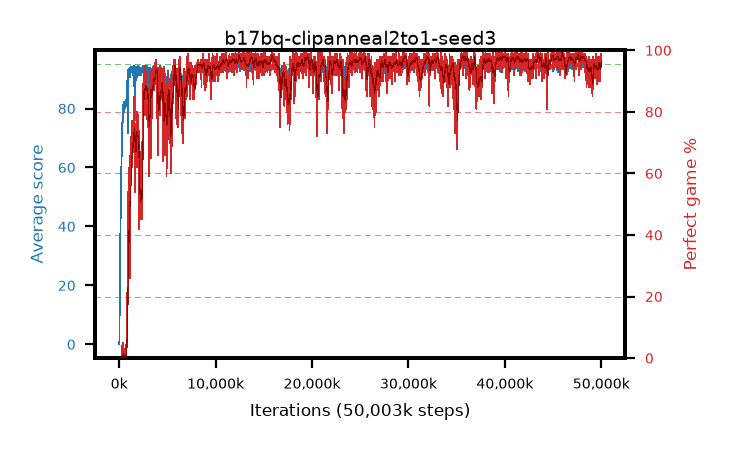

# b17bq-clipanneal2to1-seed3

step **50,003,968** · 3052 evals · trailing **94.06** · peak **94.58** @48,283,648 · sef **92.6** · best30 **97.8** @39,993,344

## Config

| | |
|---|---|
| algo | ppo |
| collect_envs | 128 |
| discount | 0.99 |
| eval_interval | 16384 |
| eval_queue | True |
| eval_queue_depth | 16 |
| eval_workers | 8 |
| fc_layers | (320,) |
| graph_eval_episodes | 100 |
| max_steps | 50003968 |
| min_checkpoint_score | 40.0 |
| ppo_adam_epsilon | 1e-07 |
| ppo_anneal_fraction | 1.0 |
| ppo_clip | 0.2 |
| ppo_clip_final | 0.1 |
| ppo_entropy_coef | 0.01 |
| ppo_entropy_coef_final | None |
| ppo_epochs | 4 |
| ppo_gae_lambda | 0.98 |
| ppo_gradient_clipping | 0.5 |
| ppo_horizon | 33.6 |
| ppo_learning_rate | 0.0003 |
| ppo_learning_rate_final | None |
| ppo_minibatch | 256 |
| ppo_normalize_adv | True |
| ppo_rollout | 128 |
| ppo_target_kl | 0.0 |
| ppo_transitions_per_rollout | 16384 |
| ppo_value_loss | huber |
| ppo_vf_coef | 0.5 |
| seed | 3 |
| torch_threads | 1 |

## Evals

| step | avg score | trailing avg | min score | max score | avg reward | perfect % | epsilon |
|---|---|---|---|---|---|---|---|
| 16384 | 0.06 | 0.06 | 0.0 | 1.0 | -4.096 | 0.0 |  |
| 32768 | 1.69 | 0.88 | 0.0 | 8.0 | 1.027 | 0.0 |  |
| 49152 | 15.57 | 5.77 | 0.0 | 38.0 | 10.943 | 0.0 |  |
| ... | ... | ... | ... | ... | ... | ... | ... |
| 49823744 | 93.19 | 93.94 | 18.0 | 95.0 | 181.899 | 90.0 |  |
| 49840128 | 93.89 | 93.94 | 70.0 | 95.0 | 186.597 | 94.0 |  |
| 49856512 | 94.42 | 93.93 | 73.0 | 95.0 | 188.132 | 95.0 |  |
| 49872896 | 94.23 | 93.97 | 75.0 | 95.0 | 186.947 | 94.0 |  |
| 49889280 | 93.8 | 94.05 | 12.0 | 95.0 | 188.513 | 96.0 |  |
| 49905664 | 94.28 | 94.09 | 68.0 | 95.0 | 188.003 | 95.0 |  |
| 49922048 | 94.7 | 94.07 | 79.0 | 95.0 | 191.408 | 98.0 |  |
| 49938432 | 94.35 | 94.08 | 30.0 | 95.0 | 192.056 | 99.0 |  |
| 49954816 | 94.04 | 94.06 | 30.0 | 95.0 | 187.746 | 95.0 |  |
| 49971200 | 94.85 | 94.07 | 83.0 | 95.0 | 191.551 | 98.0 |  |
| 49987584 | 93.96 | 94.11 | 32.0 | 95.0 | 187.678 | 95.0 |  |
| 50003968 | 94.6 | 94.06 | 69.0 | 95.0 | 191.306 | 98.0 |  |
