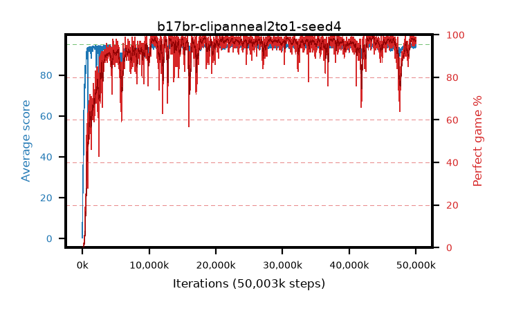

# b17br-clipanneal2to1-seed4

step **50,003,968** · 3052 evals · trailing **94.43** · peak **94.6** @43,859,968 · sef **92.7** · best30 **98.5** @43,745,280

## Config

| | |
|---|---|
| algo | ppo |
| collect_envs | 128 |
| discount | 0.99 |
| eval_interval | 16384 |
| eval_queue | True |
| eval_queue_depth | 16 |
| eval_workers | 8 |
| fc_layers | (320,) |
| graph_eval_episodes | 100 |
| max_steps | 50003968 |
| min_checkpoint_score | 40.0 |
| ppo_adam_epsilon | 1e-07 |
| ppo_anneal_fraction | 1.0 |
| ppo_clip | 0.2 |
| ppo_clip_final | 0.1 |
| ppo_entropy_coef | 0.01 |
| ppo_entropy_coef_final | None |
| ppo_epochs | 4 |
| ppo_gae_lambda | 0.98 |
| ppo_gradient_clipping | 0.5 |
| ppo_horizon | 33.6 |
| ppo_learning_rate | 0.0003 |
| ppo_learning_rate_final | None |
| ppo_minibatch | 256 |
| ppo_normalize_adv | True |
| ppo_rollout | 128 |
| ppo_target_kl | 0.0 |
| ppo_transitions_per_rollout | 16384 |
| ppo_value_loss | huber |
| ppo_vf_coef | 0.5 |
| seed | 4 |
| torch_threads | 1 |

## Evals

| step | avg score | trailing avg | min score | max score | avg reward | perfect % | epsilon |
|---|---|---|---|---|---|---|---|
| 16384 | 0.32 | 0.32 | 0.0 | 2.0 | -0.546 | 0.0 |  |
| 32768 | 17.23 | 19.05 | 1.0 | 36.0 | 13.002 | 0.0 |  |
| 49152 | 26.43 | 13.38 | 2.0 | 46.0 | 21.384 | 0.0 |  |
| ... | ... | ... | ... | ... | ... | ... | ... |
| 49823744 | 93.2 | 94.44 | 5.0 | 95.0 | 188.923 | 97.0 |  |
| 49840128 | 94.61 | 94.42 | 72.0 | 95.0 | 189.337 | 96.0 |  |
| 49856512 | 94.63 | 94.42 | 58.0 | 95.0 | 192.344 | 99.0 |  |
| 49872896 | 94.37 | 94.38 | 60.0 | 95.0 | 191.077 | 98.0 |  |
| 49889280 | 94.77 | 94.54 | 85.0 | 95.0 | 189.476 | 96.0 |  |
| 49905664 | 94.03 | 94.47 | 28.0 | 95.0 | 190.744 | 98.0 |  |
| 49922048 | 94.34 | 94.46 | 64.0 | 95.0 | 189.049 | 96.0 |  |
| 49938432 | 94.9 | 94.47 | 85.0 | 95.0 | 192.601 | 99.0 |  |
| 49954816 | 94.8 | 94.46 | 86.0 | 95.0 | 190.489 | 97.0 |  |
| 49971200 | 94.57 | 94.45 | 70.0 | 95.0 | 189.274 | 96.0 |  |
| 49987584 | 94.09 | 94.4 | 20.0 | 95.0 | 188.799 | 96.0 |  |
| 50003968 | 93.91 | 94.43 | 4.0 | 95.0 | 189.586 | 97.0 |  |
