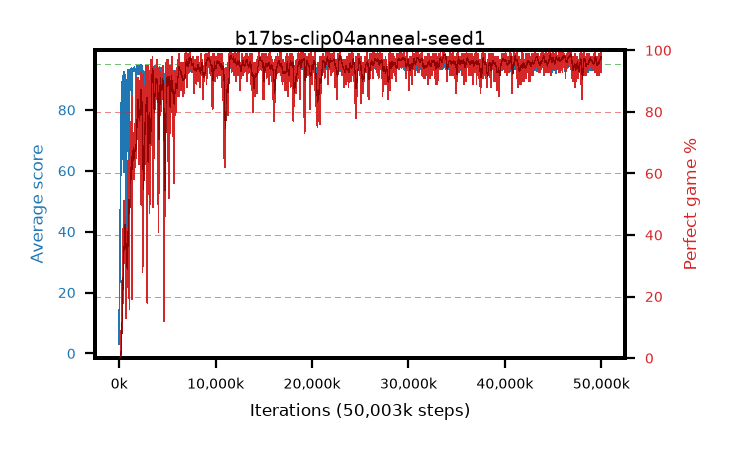

# b17bs-clip04anneal-seed1

step **50,003,968** · 3052 evals · trailing **94.06** · peak **94.6** @46,546,944 · sef **93.5** · best30 **98.0** @46,874,624

## Config

| | |
|---|---|
| algo | ppo |
| collect_envs | 128 |
| discount | 0.99 |
| eval_interval | 16384 |
| eval_queue | True |
| eval_queue_depth | 16 |
| eval_workers | 8 |
| fc_layers | (320,) |
| graph_eval_episodes | 100 |
| max_steps | 50003968 |
| min_checkpoint_score | 40.0 |
| ppo_adam_epsilon | 1e-07 |
| ppo_anneal_fraction | 1.0 |
| ppo_clip | 0.4 |
| ppo_clip_final | 0.02 |
| ppo_entropy_coef | 0.01 |
| ppo_entropy_coef_final | None |
| ppo_epochs | 4 |
| ppo_gae_lambda | 0.98 |
| ppo_gradient_clipping | 0.5 |
| ppo_horizon | 33.6 |
| ppo_learning_rate | 0.0003 |
| ppo_learning_rate_final | None |
| ppo_minibatch | 256 |
| ppo_normalize_adv | True |
| ppo_rollout | 128 |
| ppo_target_kl | 0.0 |
| ppo_transitions_per_rollout | 16384 |
| ppo_value_loss | huber |
| ppo_vf_coef | 0.5 |
| seed | 1 |
| torch_threads | 1 |

## Evals

| step | avg score | trailing avg | min score | max score | avg reward | perfect % | epsilon |
|---|---|---|---|---|---|---|---|
| 16384 | 3.06 | 3.06 | 0.0 | 11.0 | 2.499 | 0.0 |  |
| 32768 | 21.96 | 12.51 | 7.0 | 36.0 | 16.942 | 0.0 |  |
| 49152 | 23.84 | 16.29 | 9.0 | 47.0 | 18.818 | 0.0 |  |
| ... | ... | ... | ... | ... | ... | ... | ... |
| 49823744 | 94.28 | 94.04 | 57.0 | 95.0 | 190.988 | 98.0 |  |
| 49840128 | 94.41 | 94.07 | 36.0 | 95.0 | 192.117 | 99.0 |  |
| 49856512 | 94.85 | 94.06 | 86.0 | 95.0 | 191.563 | 98.0 |  |
| 49872896 | 94.05 | 93.95 | 30.0 | 95.0 | 190.773 | 98.0 |  |
| 49889280 | 93.7 | 94.03 | 26.0 | 95.0 | 189.416 | 97.0 |  |
| 49905664 | 94.46 | 93.98 | 65.0 | 95.0 | 191.167 | 98.0 |  |
| 49922048 | 94.74 | 93.97 | 69.0 | 95.0 | 192.439 | 99.0 |  |
| 49938432 | 95.0 | 94.02 | 95.0 | 95.0 | 193.706 | 100.0 |  |
| 49954816 | 94.62 | 94.05 | 72.0 | 95.0 | 189.345 | 96.0 |  |
| 49971200 | 93.8 | 94.03 | 20.0 | 95.0 | 189.524 | 97.0 |  |
| 49987584 | 94.7 | 94.12 | 74.0 | 95.0 | 191.42 | 98.0 |  |
| 50003968 | 92.89 | 94.06 | 12.0 | 95.0 | 184.627 | 93.0 |  |
