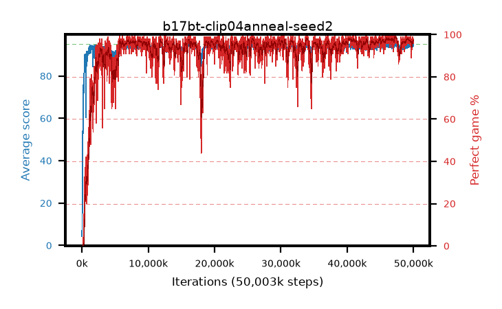

# b17bt-clip04anneal-seed2

step **50,003,968** · 3052 evals · trailing **94.29** · peak **94.67** @47,546,368 · sef **93.5** · best30 **98.4** @47,529,984

## Config

| | |
|---|---|
| algo | ppo |
| collect_envs | 128 |
| discount | 0.99 |
| eval_interval | 16384 |
| eval_queue | True |
| eval_queue_depth | 16 |
| eval_workers | 8 |
| fc_layers | (320,) |
| graph_eval_episodes | 100 |
| max_steps | 50003968 |
| min_checkpoint_score | 40.0 |
| ppo_adam_epsilon | 1e-07 |
| ppo_anneal_fraction | 1.0 |
| ppo_clip | 0.4 |
| ppo_clip_final | 0.02 |
| ppo_entropy_coef | 0.01 |
| ppo_entropy_coef_final | None |
| ppo_epochs | 4 |
| ppo_gae_lambda | 0.98 |
| ppo_gradient_clipping | 0.5 |
| ppo_horizon | 33.6 |
| ppo_learning_rate | 0.0003 |
| ppo_learning_rate_final | None |
| ppo_minibatch | 256 |
| ppo_normalize_adv | True |
| ppo_rollout | 128 |
| ppo_target_kl | 0.0 |
| ppo_transitions_per_rollout | 16384 |
| ppo_value_loss | huber |
| ppo_vf_coef | 0.5 |
| seed | 2 |
| torch_threads | 1 |

## Evals

| step | avg score | trailing avg | min score | max score | avg reward | perfect % | epsilon |
|---|---|---|---|---|---|---|---|
| 16384 | 4.31 | 4.31 | 0.0 | 12.0 | -0.354 | 0.0 |  |
| 32768 | 9.23 | 6.77 | 2.0 | 21.0 | 4.223 | 0.0 |  |
| 49152 | 21.61 | 11.72 | 6.0 | 52.0 | 16.587 | 0.0 |  |
| ... | ... | ... | ... | ... | ... | ... | ... |
| 49823744 | 94.6 | 94.21 | 62.0 | 95.0 | 190.323 | 97.0 |  |
| 49840128 | 94.9 | 94.28 | 89.0 | 95.0 | 191.621 | 98.0 |  |
| 49856512 | 94.61 | 94.28 | 56.0 | 95.0 | 192.333 | 99.0 |  |
| 49872896 | 94.67 | 94.28 | 67.0 | 95.0 | 191.384 | 98.0 |  |
| 49889280 | 94.27 | 94.27 | 58.0 | 95.0 | 190.003 | 97.0 |  |
| 49905664 | 93.72 | 94.28 | 14.0 | 95.0 | 189.409 | 97.0 |  |
| 49922048 | 94.54 | 94.3 | 59.0 | 95.0 | 191.265 | 98.0 |  |
| 49938432 | 93.9 | 94.28 | 60.0 | 95.0 | 188.636 | 96.0 |  |
| 49954816 | 94.74 | 94.29 | 86.0 | 95.0 | 189.468 | 96.0 |  |
| 49971200 | 94.3 | 94.3 | 60.0 | 95.0 | 189.033 | 96.0 |  |
| 49987584 | 94.66 | 94.27 | 69.0 | 95.0 | 191.386 | 98.0 |  |
| 50003968 | 94.49 | 94.29 | 56.0 | 95.0 | 191.221 | 98.0 |  |
