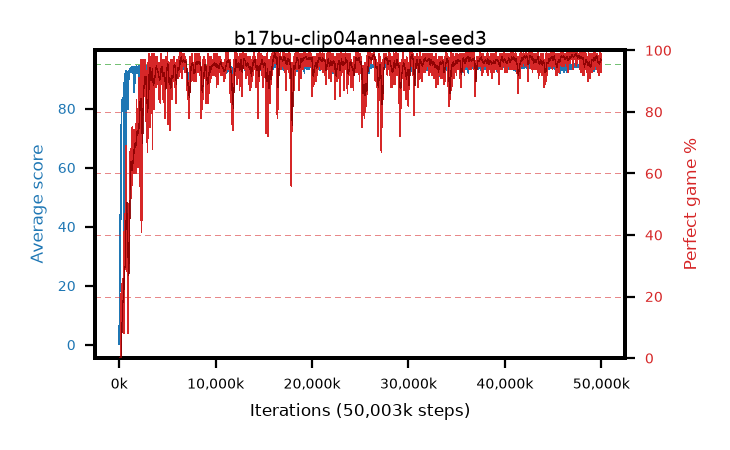

# b17bu-clip04anneal-seed3

step **50,003,968** · 3052 evals · trailing **94.07** · peak **94.63** @47,792,128 · sef **94.5** · best30 **98.3** @47,251,456

## Config

| | |
|---|---|
| algo | ppo |
| collect_envs | 128 |
| discount | 0.99 |
| eval_interval | 16384 |
| eval_queue | True |
| eval_queue_depth | 16 |
| eval_workers | 8 |
| fc_layers | (320,) |
| graph_eval_episodes | 100 |
| max_steps | 50003968 |
| min_checkpoint_score | 40.0 |
| ppo_adam_epsilon | 1e-07 |
| ppo_anneal_fraction | 1.0 |
| ppo_clip | 0.4 |
| ppo_clip_final | 0.02 |
| ppo_entropy_coef | 0.01 |
| ppo_entropy_coef_final | None |
| ppo_epochs | 4 |
| ppo_gae_lambda | 0.98 |
| ppo_gradient_clipping | 0.5 |
| ppo_horizon | 33.6 |
| ppo_learning_rate | 0.0003 |
| ppo_learning_rate_final | None |
| ppo_minibatch | 256 |
| ppo_normalize_adv | True |
| ppo_rollout | 128 |
| ppo_target_kl | 0.0 |
| ppo_transitions_per_rollout | 16384 |
| ppo_value_loss | huber |
| ppo_vf_coef | 0.5 |
| seed | 3 |
| torch_threads | 1 |

## Evals

| step | avg score | trailing avg | min score | max score | avg reward | perfect % | epsilon |
|---|---|---|---|---|---|---|---|
| 16384 | 0.22 | 0.22 | 0.0 | 2.0 | -0.334 | 0.0 |  |
| 32768 | 16.19 | 8.21 | 0.0 | 31.0 | 11.382 | 0.0 |  |
| 49152 | 21.38 | 12.6 | 7.0 | 40.0 | 16.358 | 0.0 |  |
| ... | ... | ... | ... | ... | ... | ... | ... |
| 49823744 | 94.23 | 93.95 | 63.0 | 95.0 | 189.903 | 97.0 |  |
| 49840128 | 93.16 | 93.96 | 3.0 | 95.0 | 187.844 | 96.0 |  |
| 49856512 | 94.26 | 93.91 | 42.0 | 95.0 | 188.934 | 96.0 |  |
| 49872896 | 93.54 | 93.91 | 6.0 | 95.0 | 189.207 | 97.0 |  |
| 49889280 | 93.83 | 93.89 | 8.0 | 95.0 | 189.548 | 97.0 |  |
| 49905664 | 95.0 | 93.91 | 95.0 | 95.0 | 193.713 | 100.0 |  |
| 49922048 | 92.58 | 94.1 | 6.0 | 95.0 | 187.222 | 96.0 |  |
| 49938432 | 94.16 | 94.09 | 11.0 | 95.0 | 191.828 | 99.0 |  |
| 49954816 | 92.85 | 93.91 | 10.0 | 95.0 | 184.447 | 93.0 |  |
| 49971200 | 93.46 | 94.02 | 8.0 | 95.0 | 187.185 | 95.0 |  |
| 49987584 | 94.43 | 93.93 | 62.0 | 95.0 | 191.095 | 98.0 |  |
| 50003968 | 93.83 | 94.07 | 42.0 | 95.0 | 189.465 | 97.0 |  |
