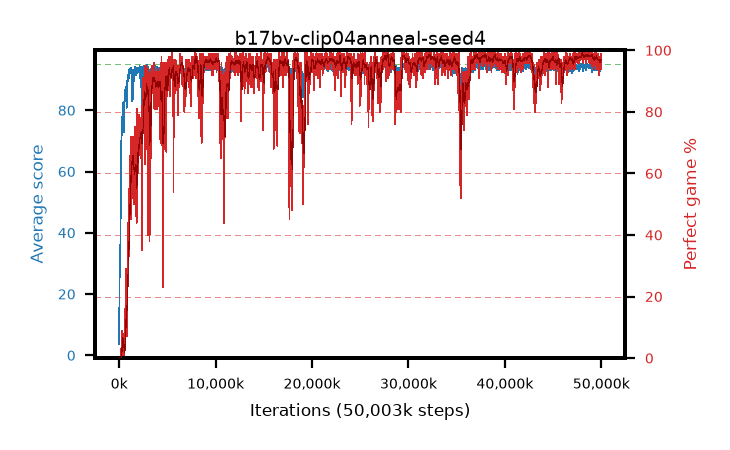

# b17bv-clip04anneal-seed4

step **50,003,968** · 3052 evals · trailing **94.19** · peak **94.61** @29,736,960 · sef **91.3** · best30 **98.6** @48,365,568

## Config

| | |
|---|---|
| algo | ppo |
| collect_envs | 128 |
| discount | 0.99 |
| eval_interval | 16384 |
| eval_queue | True |
| eval_queue_depth | 16 |
| eval_workers | 8 |
| fc_layers | (320,) |
| graph_eval_episodes | 100 |
| max_steps | 50003968 |
| min_checkpoint_score | 40.0 |
| ppo_adam_epsilon | 1e-07 |
| ppo_anneal_fraction | 1.0 |
| ppo_clip | 0.4 |
| ppo_clip_final | 0.02 |
| ppo_entropy_coef | 0.01 |
| ppo_entropy_coef_final | None |
| ppo_epochs | 4 |
| ppo_gae_lambda | 0.98 |
| ppo_gradient_clipping | 0.5 |
| ppo_horizon | 33.6 |
| ppo_learning_rate | 0.0003 |
| ppo_learning_rate_final | None |
| ppo_minibatch | 256 |
| ppo_normalize_adv | True |
| ppo_rollout | 128 |
| ppo_target_kl | 0.0 |
| ppo_transitions_per_rollout | 16384 |
| ppo_value_loss | huber |
| ppo_vf_coef | 0.5 |
| seed | 4 |
| torch_threads | 1 |

## Evals

| step | avg score | trailing avg | min score | max score | avg reward | perfect % | epsilon |
|---|---|---|---|---|---|---|---|
| 16384 | 3.66 | 3.66 | 1.0 | 14.0 | -0.489 | 0.0 |  |
| 32768 | 23.42 | 18.95 | 8.0 | 46.0 | 18.397 | 0.0 |  |
| 49152 | 26.21 | 20.77 | 11.0 | 52.0 | 21.231 | 0.0 |  |
| ... | ... | ... | ... | ... | ... | ... | ... |
| 49823744 | 93.05 | 94.23 | 6.0 | 95.0 | 186.735 | 95.0 |  |
| 49840128 | 94.01 | 94.17 | 14.0 | 95.0 | 190.7 | 98.0 |  |
| 49856512 | 92.84 | 94.26 | 8.0 | 95.0 | 187.509 | 96.0 |  |
| 49872896 | 93.84 | 94.17 | 18.0 | 95.0 | 188.546 | 96.0 |  |
| 49889280 | 94.81 | 94.18 | 86.0 | 95.0 | 190.507 | 97.0 |  |
| 49905664 | 94.06 | 94.16 | 38.0 | 95.0 | 188.76 | 96.0 |  |
| 49922048 | 94.54 | 94.19 | 61.0 | 95.0 | 191.234 | 98.0 |  |
| 49938432 | 94.41 | 94.18 | 36.0 | 95.0 | 192.12 | 99.0 |  |
| 49954816 | 94.85 | 94.19 | 85.0 | 95.0 | 191.552 | 98.0 |  |
| 49971200 | 93.59 | 94.14 | 10.0 | 95.0 | 186.31 | 94.0 |  |
| 49987584 | 94.85 | 94.15 | 89.0 | 95.0 | 190.546 | 97.0 |  |
| 50003968 | 93.97 | 94.19 | 26.0 | 95.0 | 189.668 | 97.0 |  |
