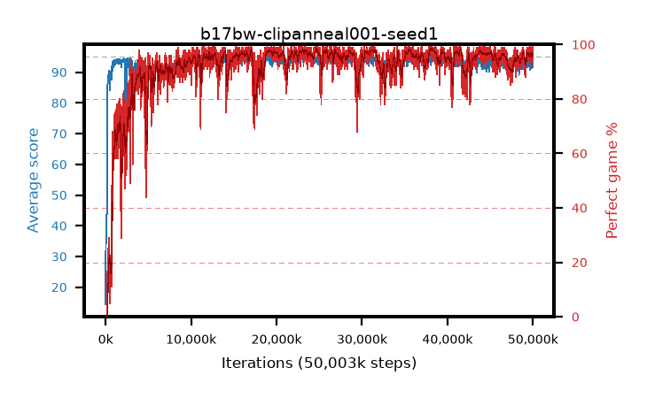

# b17bw-clipanneal001-seed1

step **50,003,968** · 3052 evals · trailing **93.11** · peak **94.56** @23,379,968 · sef **92.7** · best30 **98.2** @38,273,024

## Config

| | |
|---|---|
| algo | ppo |
| collect_envs | 128 |
| discount | 0.99 |
| eval_interval | 16384 |
| eval_queue | True |
| eval_queue_depth | 16 |
| eval_workers | 8 |
| fc_layers | (320,) |
| graph_eval_episodes | 100 |
| max_steps | 50003968 |
| min_checkpoint_score | 40.0 |
| ppo_adam_epsilon | 1e-07 |
| ppo_anneal_fraction | 1.0 |
| ppo_clip | 0.2 |
| ppo_clip_final | 0.001 |
| ppo_entropy_coef | 0.01 |
| ppo_entropy_coef_final | None |
| ppo_epochs | 4 |
| ppo_gae_lambda | 0.98 |
| ppo_gradient_clipping | 0.5 |
| ppo_horizon | 33.6 |
| ppo_learning_rate | 0.0003 |
| ppo_learning_rate_final | None |
| ppo_minibatch | 256 |
| ppo_normalize_adv | True |
| ppo_rollout | 128 |
| ppo_target_kl | 0.0 |
| ppo_transitions_per_rollout | 16384 |
| ppo_value_loss | huber |
| ppo_vf_coef | 0.5 |
| seed | 1 |
| torch_threads | 1 |

## Evals

| step | avg score | trailing avg | min score | max score | avg reward | perfect % | epsilon |
|---|---|---|---|---|---|---|---|
| 16384 | 14.39 | 24.22 | 1.0 | 37.0 | 12.191 | 0.0 |  |
| 32768 | 43.57 | 35.79 | 10.0 | 88.0 | 38.468 | 0.0 |  |
| 49152 | 34.05 | 34.05 | 1.0 | 68.0 | 29.025 | 0.0 |  |
| ... | ... | ... | ... | ... | ... | ... | ... |
| 49823744 | 91.69 | 93.3 | 1.0 | 95.0 | 184.421 | 94.0 |  |
| 49840128 | 92.87 | 93.24 | 8.0 | 95.0 | 188.591 | 97.0 |  |
| 49856512 | 91.3 | 93.16 | 1.0 | 95.0 | 183.037 | 93.0 |  |
| 49872896 | 91.87 | 93.15 | 1.0 | 95.0 | 182.603 | 92.0 |  |
| 49889280 | 93.28 | 93.27 | 7.0 | 95.0 | 189.007 | 97.0 |  |
| 49905664 | 93.09 | 93.11 | 6.0 | 95.0 | 187.814 | 96.0 |  |
| 49922048 | 94.22 | 93.18 | 17.0 | 95.0 | 191.94 | 99.0 |  |
| 49938432 | 95.0 | 93.2 | 95.0 | 95.0 | 193.701 | 100.0 |  |
| 49954816 | 93.71 | 93.23 | 1.0 | 95.0 | 190.425 | 98.0 |  |
| 49971200 | 93.89 | 93.23 | 4.0 | 95.0 | 189.606 | 97.0 |  |
| 49987584 | 94.98 | 93.26 | 93.0 | 95.0 | 192.69 | 99.0 |  |
| 50003968 | 91.75 | 93.11 | 13.0 | 95.0 | 185.484 | 95.0 |  |
