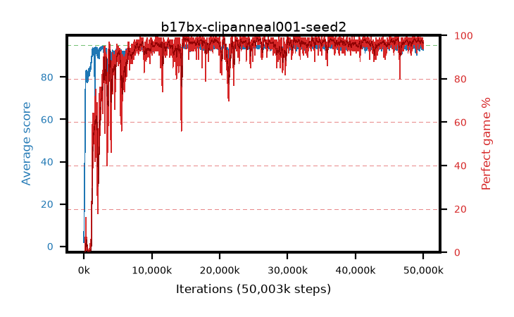

# b17bx-clipanneal001-seed2

step **50,003,968** · 3052 evals · trailing **94.02** · peak **94.64** @15,089,664 · sef **92.6** · best30 **98.4** @15,024,128

## Config

| | |
|---|---|
| algo | ppo |
| collect_envs | 128 |
| discount | 0.99 |
| eval_interval | 16384 |
| eval_queue | True |
| eval_queue_depth | 16 |
| eval_workers | 8 |
| fc_layers | (320,) |
| graph_eval_episodes | 100 |
| max_steps | 50003968 |
| min_checkpoint_score | 40.0 |
| ppo_adam_epsilon | 1e-07 |
| ppo_anneal_fraction | 1.0 |
| ppo_clip | 0.2 |
| ppo_clip_final | 0.001 |
| ppo_entropy_coef | 0.01 |
| ppo_entropy_coef_final | None |
| ppo_epochs | 4 |
| ppo_gae_lambda | 0.98 |
| ppo_gradient_clipping | 0.5 |
| ppo_horizon | 33.6 |
| ppo_learning_rate | 0.0003 |
| ppo_learning_rate_final | None |
| ppo_minibatch | 256 |
| ppo_normalize_adv | True |
| ppo_rollout | 128 |
| ppo_target_kl | 0.0 |
| ppo_transitions_per_rollout | 16384 |
| ppo_value_loss | huber |
| ppo_vf_coef | 0.5 |
| seed | 2 |
| torch_threads | 1 |

## Evals

| step | avg score | trailing avg | min score | max score | avg reward | perfect % | epsilon |
|---|---|---|---|---|---|---|---|
| 16384 | 1.84 | 1.84 | 0.0 | 5.0 | -0.453 | 0.0 |  |
| 32768 | 12.41 | 7.12 | 4.0 | 26.0 | 7.366 | 0.0 |  |
| 49152 | 25.0 | 13.08 | 6.0 | 47.0 | 20.041 | 0.0 |  |
| ... | ... | ... | ... | ... | ... | ... | ... |
| 49823744 | 94.22 | 94.1 | 64.0 | 95.0 | 187.923 | 95.0 |  |
| 49840128 | 94.03 | 94.08 | 66.0 | 95.0 | 186.752 | 94.0 |  |
| 49856512 | 94.1 | 94.08 | 5.0 | 95.0 | 191.813 | 99.0 |  |
| 49872896 | 94.52 | 94.12 | 58.0 | 95.0 | 191.234 | 98.0 |  |
| 49889280 | 93.84 | 94.0 | 60.0 | 95.0 | 186.546 | 94.0 |  |
| 49905664 | 94.53 | 94.01 | 57.0 | 95.0 | 191.239 | 98.0 |  |
| 49922048 | 94.68 | 94.0 | 70.0 | 95.0 | 191.399 | 98.0 |  |
| 49938432 | 93.7 | 94.09 | 28.0 | 95.0 | 188.419 | 96.0 |  |
| 49954816 | 93.54 | 94.09 | 5.0 | 95.0 | 188.255 | 96.0 |  |
| 49971200 | 93.27 | 94.04 | 26.0 | 95.0 | 186.987 | 95.0 |  |
| 49987584 | 92.84 | 94.08 | 3.0 | 95.0 | 186.564 | 95.0 |  |
| 50003968 | 92.66 | 94.02 | 20.0 | 95.0 | 185.386 | 94.0 |  |
