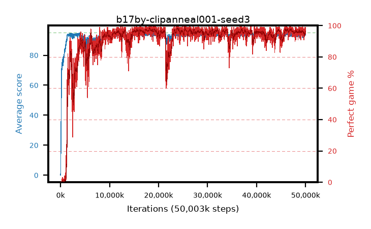

# b17by-clipanneal001-seed3

step **50,003,968** · 3052 evals · trailing **93.5** · peak **94.42** @26,411,008 · sef **91.3** · best30 **97.7** @18,481,152

## Config

| | |
|---|---|
| algo | ppo |
| collect_envs | 128 |
| discount | 0.99 |
| eval_interval | 16384 |
| eval_queue | True |
| eval_queue_depth | 16 |
| eval_workers | 8 |
| fc_layers | (320,) |
| graph_eval_episodes | 100 |
| max_steps | 50003968 |
| min_checkpoint_score | 40.0 |
| ppo_adam_epsilon | 1e-07 |
| ppo_anneal_fraction | 1.0 |
| ppo_clip | 0.2 |
| ppo_clip_final | 0.001 |
| ppo_entropy_coef | 0.01 |
| ppo_entropy_coef_final | None |
| ppo_epochs | 4 |
| ppo_gae_lambda | 0.98 |
| ppo_gradient_clipping | 0.5 |
| ppo_horizon | 33.6 |
| ppo_learning_rate | 0.0003 |
| ppo_learning_rate_final | None |
| ppo_minibatch | 256 |
| ppo_normalize_adv | True |
| ppo_rollout | 128 |
| ppo_target_kl | 0.0 |
| ppo_transitions_per_rollout | 16384 |
| ppo_value_loss | huber |
| ppo_vf_coef | 0.5 |
| seed | 3 |
| torch_threads | 1 |

## Evals

| step | avg score | trailing avg | min score | max score | avg reward | perfect % | epsilon |
|---|---|---|---|---|---|---|---|
| 16384 | 0.06 | 0.06 | 0.0 | 2.0 | -2.716 | 0.0 |  |
| 32768 | 1.47 | 0.77 | 0.0 | 7.0 | 0.909 | 0.0 |  |
| 49152 | 20.62 | 23.03 | 2.0 | 44.0 | 15.728 | 0.0 |  |
| ... | ... | ... | ... | ... | ... | ... | ... |
| 49823744 | 93.6 | 93.36 | 56.0 | 95.0 | 187.325 | 95.0 |  |
| 49840128 | 94.09 | 93.36 | 56.0 | 95.0 | 187.817 | 95.0 |  |
| 49856512 | 94.09 | 93.39 | 4.0 | 95.0 | 191.806 | 99.0 |  |
| 49872896 | 93.6 | 93.38 | 56.0 | 95.0 | 186.331 | 94.0 |  |
| 49889280 | 93.85 | 93.4 | 56.0 | 95.0 | 188.57 | 96.0 |  |
| 49905664 | 93.91 | 93.42 | 52.0 | 95.0 | 187.635 | 95.0 |  |
| 49922048 | 94.27 | 93.36 | 22.0 | 95.0 | 191.987 | 99.0 |  |
| 49938432 | 94.44 | 93.38 | 78.0 | 95.0 | 188.146 | 95.0 |  |
| 49954816 | 94.76 | 93.37 | 71.0 | 95.0 | 192.47 | 99.0 |  |
| 49971200 | 94.26 | 93.49 | 54.0 | 95.0 | 189.983 | 97.0 |  |
| 49987584 | 94.08 | 93.53 | 62.0 | 95.0 | 188.802 | 96.0 |  |
| 50003968 | 93.47 | 93.5 | 56.0 | 95.0 | 187.196 | 95.0 |  |
