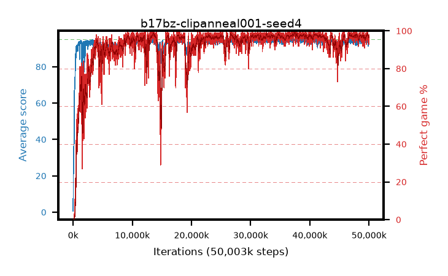

# b17bz-clipanneal001-seed4

step **50,003,968** · 3052 evals · trailing **94.1** · peak **94.65** @37,666,816 · sef **91.3** · best30 **98.6** @37,502,976

## Config

| | |
|---|---|
| algo | ppo |
| collect_envs | 128 |
| discount | 0.99 |
| eval_interval | 16384 |
| eval_queue | True |
| eval_queue_depth | 16 |
| eval_workers | 8 |
| fc_layers | (320,) |
| graph_eval_episodes | 100 |
| max_steps | 50003968 |
| min_checkpoint_score | 40.0 |
| ppo_adam_epsilon | 1e-07 |
| ppo_anneal_fraction | 1.0 |
| ppo_clip | 0.2 |
| ppo_clip_final | 0.001 |
| ppo_entropy_coef | 0.01 |
| ppo_entropy_coef_final | None |
| ppo_epochs | 4 |
| ppo_gae_lambda | 0.98 |
| ppo_gradient_clipping | 0.5 |
| ppo_horizon | 33.6 |
| ppo_learning_rate | 0.0003 |
| ppo_learning_rate_final | None |
| ppo_minibatch | 256 |
| ppo_normalize_adv | True |
| ppo_rollout | 128 |
| ppo_target_kl | 0.0 |
| ppo_transitions_per_rollout | 16384 |
| ppo_value_loss | huber |
| ppo_vf_coef | 0.5 |
| seed | 4 |
| torch_threads | 1 |

## Evals

| step | avg score | trailing avg | min score | max score | avg reward | perfect % | epsilon |
|---|---|---|---|---|---|---|---|
| 16384 | 0.62 | 0.62 | 0.0 | 4.0 | -0.386 | 0.0 |  |
| 32768 | 17.55 | 9.09 | 0.0 | 39.0 | 13.18 | 0.0 |  |
| 49152 | 24.86 | 16.91 | 9.0 | 51.0 | 19.823 | 0.0 |  |
| ... | ... | ... | ... | ... | ... | ... | ... |
| 49823744 | 94.75 | 94.12 | 81.0 | 95.0 | 191.467 | 98.0 |  |
| 49840128 | 91.28 | 94.13 | 2.0 | 95.0 | 184.025 | 94.0 |  |
| 49856512 | 94.24 | 94.14 | 56.0 | 95.0 | 188.96 | 96.0 |  |
| 49872896 | 94.84 | 94.19 | 86.0 | 95.0 | 191.548 | 98.0 |  |
| 49889280 | 94.42 | 94.15 | 53.0 | 95.0 | 190.126 | 97.0 |  |
| 49905664 | 93.56 | 94.15 | 30.0 | 95.0 | 189.234 | 97.0 |  |
| 49922048 | 93.39 | 94.21 | 10.0 | 95.0 | 189.123 | 97.0 |  |
| 49938432 | 94.19 | 94.22 | 58.0 | 95.0 | 189.916 | 97.0 |  |
| 49954816 | 94.58 | 94.19 | 56.0 | 95.0 | 191.303 | 98.0 |  |
| 49971200 | 92.52 | 94.16 | 49.0 | 95.0 | 184.257 | 93.0 |  |
| 49987584 | 93.98 | 94.14 | 30.0 | 95.0 | 190.694 | 98.0 |  |
| 50003968 | 93.71 | 94.1 | 56.0 | 95.0 | 188.433 | 96.0 |  |
