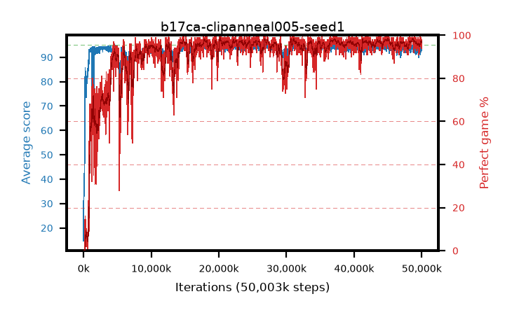

# b17ca-clipanneal005-seed1

step **50,003,968** · 3052 evals · trailing **93.22** · peak **94.46** @22,528,000 · sef **89.4** · best30 **97.9** @37,289,984

## Config

| | |
|---|---|
| algo | ppo |
| collect_envs | 128 |
| discount | 0.99 |
| eval_interval | 16384 |
| eval_queue | True |
| eval_queue_depth | 16 |
| eval_workers | 8 |
| fc_layers | (320,) |
| graph_eval_episodes | 100 |
| max_steps | 50003968 |
| min_checkpoint_score | 40.0 |
| ppo_adam_epsilon | 1e-07 |
| ppo_anneal_fraction | 1.0 |
| ppo_clip | 0.2 |
| ppo_clip_final | 0.005 |
| ppo_entropy_coef | 0.01 |
| ppo_entropy_coef_final | None |
| ppo_epochs | 4 |
| ppo_gae_lambda | 0.98 |
| ppo_gradient_clipping | 0.5 |
| ppo_horizon | 33.6 |
| ppo_learning_rate | 0.0003 |
| ppo_learning_rate_final | None |
| ppo_minibatch | 256 |
| ppo_normalize_adv | True |
| ppo_rollout | 128 |
| ppo_target_kl | 0.0 |
| ppo_transitions_per_rollout | 16384 |
| ppo_value_loss | huber |
| ppo_vf_coef | 0.5 |
| seed | 1 |
| torch_threads | 1 |

## Evals

| step | avg score | trailing avg | min score | max score | avg reward | perfect % | epsilon |
|---|---|---|---|---|---|---|---|
| 16384 | 14.68 | 28.5 | 1.0 | 39.0 | 12.698 | 0.0 |  |
| 32768 | 42.32 | 42.32 | 13.0 | 72.0 | 37.234 | 0.0 |  |
| 49152 | 39.14 | 33.43 | 12.0 | 79.0 | 34.042 | 0.0 |  |
| ... | ... | ... | ... | ... | ... | ... | ... |
| 49823744 | 94.9 | 93.14 | 85.0 | 95.0 | 192.608 | 99.0 |  |
| 49840128 | 94.31 | 93.2 | 56.0 | 95.0 | 191.03 | 98.0 |  |
| 49856512 | 93.37 | 93.17 | 3.0 | 95.0 | 190.098 | 98.0 |  |
| 49872896 | 92.26 | 93.24 | 5.0 | 95.0 | 187.002 | 96.0 |  |
| 49889280 | 93.13 | 93.23 | 7.0 | 95.0 | 188.858 | 97.0 |  |
| 49905664 | 93.2 | 93.22 | 7.0 | 95.0 | 188.94 | 97.0 |  |
| 49922048 | 93.22 | 93.21 | 9.0 | 95.0 | 187.96 | 96.0 |  |
| 49938432 | 94.38 | 93.19 | 53.0 | 95.0 | 191.106 | 98.0 |  |
| 49954816 | 93.0 | 93.17 | 10.0 | 95.0 | 187.737 | 96.0 |  |
| 49971200 | 94.43 | 93.25 | 68.0 | 95.0 | 190.157 | 97.0 |  |
| 49987584 | 93.31 | 93.24 | 3.0 | 95.0 | 188.047 | 96.0 |  |
| 50003968 | 92.87 | 93.22 | 1.0 | 95.0 | 185.608 | 94.0 |  |
