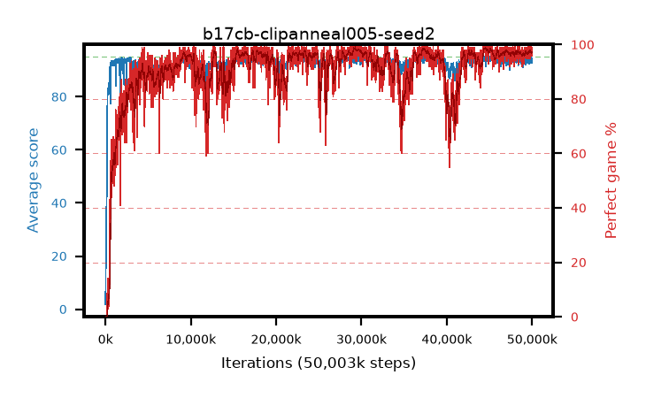

# b17cb-clipanneal005-seed2

step **50,003,968** · 3052 evals · trailing **93.8** · peak **94.54** @29,507,584 · sef **89.8** · best30 **98.5** @29,425,664

## Config

| | |
|---|---|
| algo | ppo |
| collect_envs | 128 |
| discount | 0.99 |
| eval_interval | 16384 |
| eval_queue | True |
| eval_queue_depth | 16 |
| eval_workers | 8 |
| fc_layers | (320,) |
| graph_eval_episodes | 100 |
| max_steps | 50003968 |
| min_checkpoint_score | 40.0 |
| ppo_adam_epsilon | 1e-07 |
| ppo_anneal_fraction | 1.0 |
| ppo_clip | 0.2 |
| ppo_clip_final | 0.005 |
| ppo_entropy_coef | 0.01 |
| ppo_entropy_coef_final | None |
| ppo_epochs | 4 |
| ppo_gae_lambda | 0.98 |
| ppo_gradient_clipping | 0.5 |
| ppo_horizon | 33.6 |
| ppo_learning_rate | 0.0003 |
| ppo_learning_rate_final | None |
| ppo_minibatch | 256 |
| ppo_normalize_adv | True |
| ppo_rollout | 128 |
| ppo_target_kl | 0.0 |
| ppo_transitions_per_rollout | 16384 |
| ppo_value_loss | huber |
| ppo_vf_coef | 0.5 |
| seed | 2 |
| torch_threads | 1 |

## Evals

| step | avg score | trailing avg | min score | max score | avg reward | perfect % | epsilon |
|---|---|---|---|---|---|---|---|
| 16384 | 1.81 | 1.81 | 0.0 | 6.0 | -0.797 | 0.0 |  |
| 32768 | 12.28 | 7.04 | 4.0 | 28.0 | 7.325 | 0.0 |  |
| 49152 | 24.89 | 12.99 | 6.0 | 52.0 | 19.839 | 0.0 |  |
| ... | ... | ... | ... | ... | ... | ... | ... |
| 49823744 | 93.03 | 93.91 | 3.0 | 95.0 | 187.764 | 96.0 |  |
| 49840128 | 92.84 | 93.92 | 16.0 | 95.0 | 187.567 | 96.0 |  |
| 49856512 | 92.95 | 93.93 | 12.0 | 95.0 | 187.633 | 96.0 |  |
| 49872896 | 93.16 | 93.89 | 14.0 | 95.0 | 187.889 | 96.0 |  |
| 49889280 | 93.88 | 93.91 | 20.0 | 95.0 | 189.55 | 97.0 |  |
| 49905664 | 94.48 | 93.92 | 62.0 | 95.0 | 191.199 | 98.0 |  |
| 49922048 | 94.56 | 93.91 | 51.0 | 95.0 | 192.276 | 99.0 |  |
| 49938432 | 94.66 | 93.94 | 61.0 | 95.0 | 192.354 | 99.0 |  |
| 49954816 | 93.82 | 93.94 | 4.0 | 95.0 | 190.543 | 98.0 |  |
| 49971200 | 92.65 | 93.87 | 8.0 | 95.0 | 187.377 | 96.0 |  |
| 49987584 | 93.09 | 93.84 | 1.0 | 95.0 | 187.782 | 96.0 |  |
| 50003968 | 93.41 | 93.8 | 7.0 | 95.0 | 190.141 | 98.0 |  |
