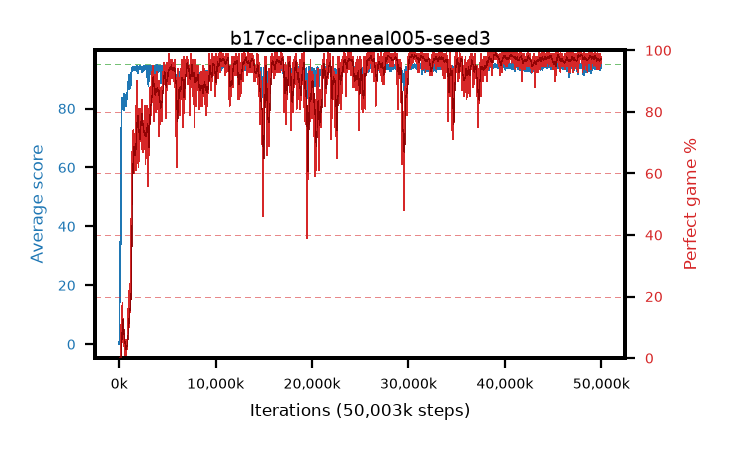

# b17cc-clipanneal005-seed3

step **50,003,968** · 3052 evals · trailing **94.3** · peak **94.57** @39,190,528 · sef **89.4** · best30 **98.5** @39,190,528

## Config

| | |
|---|---|
| algo | ppo |
| collect_envs | 128 |
| discount | 0.99 |
| eval_interval | 16384 |
| eval_queue | True |
| eval_queue_depth | 16 |
| eval_workers | 8 |
| fc_layers | (320,) |
| graph_eval_episodes | 100 |
| max_steps | 50003968 |
| min_checkpoint_score | 40.0 |
| ppo_adam_epsilon | 1e-07 |
| ppo_anneal_fraction | 1.0 |
| ppo_clip | 0.2 |
| ppo_clip_final | 0.005 |
| ppo_entropy_coef | 0.01 |
| ppo_entropy_coef_final | None |
| ppo_epochs | 4 |
| ppo_gae_lambda | 0.98 |
| ppo_gradient_clipping | 0.5 |
| ppo_horizon | 33.6 |
| ppo_learning_rate | 0.0003 |
| ppo_learning_rate_final | None |
| ppo_minibatch | 256 |
| ppo_normalize_adv | True |
| ppo_rollout | 128 |
| ppo_target_kl | 0.0 |
| ppo_transitions_per_rollout | 16384 |
| ppo_value_loss | huber |
| ppo_vf_coef | 0.5 |
| seed | 3 |
| torch_threads | 1 |

## Evals

| step | avg score | trailing avg | min score | max score | avg reward | perfect % | epsilon |
|---|---|---|---|---|---|---|---|
| 16384 | 0.03 | 0.03 | 0.0 | 1.0 | -2.969 | 0.0 |  |
| 32768 | 1.49 | 0.76 | 0.0 | 7.0 | 0.927 | 0.0 |  |
| 49152 | 20.42 | 7.31 | 2.0 | 39.0 | 15.401 | 0.0 |  |
| ... | ... | ... | ... | ... | ... | ... | ... |
| 49823744 | 94.02 | 94.23 | 58.0 | 95.0 | 188.728 | 96.0 |  |
| 49840128 | 94.78 | 94.28 | 73.0 | 95.0 | 192.499 | 99.0 |  |
| 49856512 | 94.9 | 94.28 | 88.0 | 95.0 | 191.619 | 98.0 |  |
| 49872896 | 92.9 | 94.25 | 16.0 | 95.0 | 187.635 | 96.0 |  |
| 49889280 | 94.95 | 94.27 | 90.0 | 95.0 | 192.665 | 99.0 |  |
| 49905664 | 94.17 | 94.28 | 64.0 | 95.0 | 187.902 | 95.0 |  |
| 49922048 | 94.12 | 94.26 | 20.0 | 95.0 | 188.85 | 96.0 |  |
| 49938432 | 93.84 | 94.27 | 12.0 | 95.0 | 190.576 | 98.0 |  |
| 49954816 | 94.32 | 94.3 | 59.0 | 95.0 | 190.035 | 97.0 |  |
| 49971200 | 94.66 | 94.31 | 68.0 | 95.0 | 191.38 | 98.0 |  |
| 49987584 | 93.8 | 94.27 | 16.0 | 95.0 | 188.528 | 96.0 |  |
| 50003968 | 94.43 | 94.3 | 58.0 | 95.0 | 190.16 | 97.0 |  |
