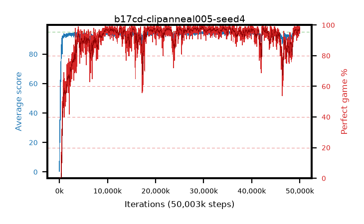

# b17cd-clipanneal005-seed4

step **50,003,968** · 3052 evals · trailing **94.39** · peak **94.58** @35,520,512 · sef **90.8** · best30 **98.4** @29,900,800

## Config

| | |
|---|---|
| algo | ppo |
| collect_envs | 128 |
| discount | 0.99 |
| eval_interval | 16384 |
| eval_queue | True |
| eval_queue_depth | 16 |
| eval_workers | 8 |
| fc_layers | (320,) |
| graph_eval_episodes | 100 |
| max_steps | 50003968 |
| min_checkpoint_score | 40.0 |
| ppo_adam_epsilon | 1e-07 |
| ppo_anneal_fraction | 1.0 |
| ppo_clip | 0.2 |
| ppo_clip_final | 0.005 |
| ppo_entropy_coef | 0.01 |
| ppo_entropy_coef_final | None |
| ppo_epochs | 4 |
| ppo_gae_lambda | 0.98 |
| ppo_gradient_clipping | 0.5 |
| ppo_horizon | 33.6 |
| ppo_learning_rate | 0.0003 |
| ppo_learning_rate_final | None |
| ppo_minibatch | 256 |
| ppo_normalize_adv | True |
| ppo_rollout | 128 |
| ppo_target_kl | 0.0 |
| ppo_transitions_per_rollout | 16384 |
| ppo_value_loss | huber |
| ppo_vf_coef | 0.5 |
| seed | 4 |
| torch_threads | 1 |

## Evals

| step | avg score | trailing avg | min score | max score | avg reward | perfect % | epsilon |
|---|---|---|---|---|---|---|---|
| 16384 | 0.42 | 0.42 | 0.0 | 3.0 | -0.628 | 0.0 |  |
| 32768 | 17.13 | 13.78 | 0.0 | 40.0 | 13.162 | 0.0 |  |
| 49152 | 23.8 | 12.11 | 7.0 | 41.0 | 18.767 | 0.0 |  |
| ... | ... | ... | ... | ... | ... | ... | ... |
| 49823744 | 94.89 | 94.37 | 84.0 | 95.0 | 192.574 | 99.0 |  |
| 49840128 | 94.02 | 94.33 | 61.0 | 95.0 | 187.736 | 95.0 |  |
| 49856512 | 94.71 | 94.35 | 76.0 | 95.0 | 190.41 | 97.0 |  |
| 49872896 | 94.85 | 94.3 | 80.0 | 95.0 | 192.562 | 99.0 |  |
| 49889280 | 94.25 | 94.29 | 20.0 | 95.0 | 191.941 | 99.0 |  |
| 49905664 | 94.65 | 94.41 | 72.0 | 95.0 | 191.36 | 98.0 |  |
| 49922048 | 94.47 | 94.41 | 57.0 | 95.0 | 191.19 | 98.0 |  |
| 49938432 | 94.26 | 94.4 | 70.0 | 95.0 | 187.974 | 95.0 |  |
| 49954816 | 94.79 | 94.41 | 84.0 | 95.0 | 191.501 | 98.0 |  |
| 49971200 | 94.62 | 94.38 | 63.0 | 95.0 | 191.341 | 98.0 |  |
| 49987584 | 94.89 | 94.4 | 84.0 | 95.0 | 192.594 | 99.0 |  |
| 50003968 | 94.1 | 94.39 | 65.0 | 95.0 | 187.826 | 95.0 |  |
