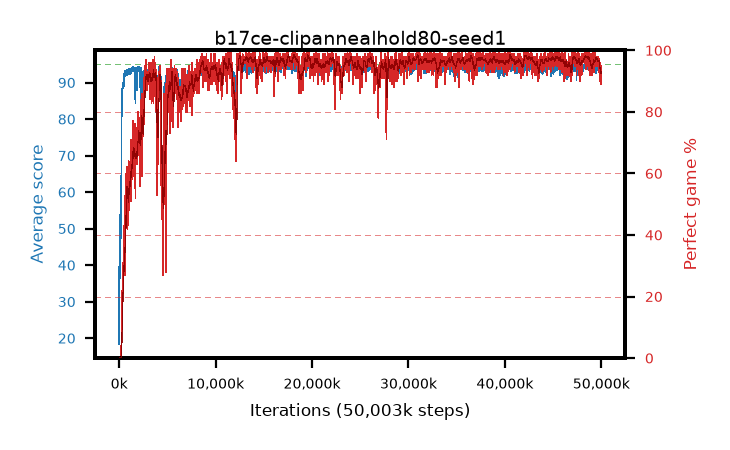

# b17ce-clipannealhold80-seed1

step **50,003,968** · 3052 evals · trailing **93.87** · peak **94.54** @48,627,712 · sef **93.2** · best30 **97.9** @42,434,560

## Config

| | |
|---|---|
| algo | ppo |
| collect_envs | 128 |
| discount | 0.99 |
| eval_interval | 16384 |
| eval_queue | True |
| eval_queue_depth | 16 |
| eval_workers | 8 |
| fc_layers | (320,) |
| graph_eval_episodes | 100 |
| max_steps | 50003968 |
| min_checkpoint_score | 40.0 |
| ppo_adam_epsilon | 1e-07 |
| ppo_anneal_fraction | 0.8 |
| ppo_clip | 0.2 |
| ppo_clip_final | 0.02 |
| ppo_entropy_coef | 0.01 |
| ppo_entropy_coef_final | None |
| ppo_epochs | 4 |
| ppo_gae_lambda | 0.98 |
| ppo_gradient_clipping | 0.5 |
| ppo_horizon | 33.6 |
| ppo_learning_rate | 0.0003 |
| ppo_learning_rate_final | None |
| ppo_minibatch | 256 |
| ppo_normalize_adv | True |
| ppo_rollout | 128 |
| ppo_target_kl | 0.0 |
| ppo_transitions_per_rollout | 16384 |
| ppo_value_loss | huber |
| ppo_vf_coef | 0.5 |
| seed | 1 |
| torch_threads | 1 |

## Evals

| step | avg score | trailing avg | min score | max score | avg reward | perfect % | epsilon |
|---|---|---|---|---|---|---|---|
| 16384 | 18.38 | 18.38 | 1.0 | 41.0 | 15.864 | 0.0 |  |
| 32768 | 53.67 | 38.68 | 10.0 | 92.0 | 48.609 | 0.0 |  |
| 49152 | 40.45 | 33.68 | 8.0 | 78.0 | 35.382 | 0.0 |  |
| ... | ... | ... | ... | ... | ... | ... | ... |
| 49823744 | 94.09 | 94.06 | 67.0 | 95.0 | 185.805 | 93.0 |  |
| 49840128 | 92.37 | 93.99 | 1.0 | 95.0 | 181.1 | 90.0 |  |
| 49856512 | 92.6 | 93.94 | 60.0 | 95.0 | 181.327 | 90.0 |  |
| 49872896 | 94.39 | 93.92 | 60.0 | 95.0 | 189.103 | 96.0 |  |
| 49889280 | 94.4 | 93.87 | 64.0 | 95.0 | 189.114 | 96.0 |  |
| 49905664 | 93.47 | 93.87 | 15.0 | 95.0 | 185.191 | 93.0 |  |
| 49922048 | 93.57 | 93.92 | 66.0 | 95.0 | 184.302 | 92.0 |  |
| 49938432 | 92.41 | 93.88 | 12.0 | 95.0 | 180.137 | 89.0 |  |
| 49954816 | 93.64 | 93.85 | 18.0 | 95.0 | 187.366 | 95.0 |  |
| 49971200 | 93.38 | 93.88 | 18.0 | 95.0 | 184.105 | 92.0 |  |
| 49987584 | 93.92 | 93.85 | 34.0 | 95.0 | 187.649 | 95.0 |  |
| 50003968 | 93.45 | 93.87 | 22.0 | 95.0 | 186.173 | 94.0 |  |
