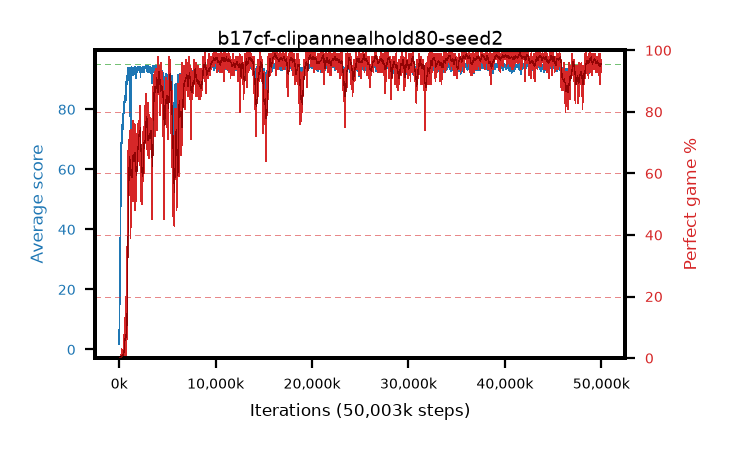

# b17cf-clipannealhold80-seed2

step **50,003,968** · 3052 evals · trailing **93.98** · peak **94.56** @39,419,904 · sef **90.6** · best30 **98.4** @41,795,584

## Config

| | |
|---|---|
| algo | ppo |
| collect_envs | 128 |
| discount | 0.99 |
| eval_interval | 16384 |
| eval_queue | True |
| eval_queue_depth | 16 |
| eval_workers | 8 |
| fc_layers | (320,) |
| graph_eval_episodes | 100 |
| max_steps | 50003968 |
| min_checkpoint_score | 40.0 |
| ppo_adam_epsilon | 1e-07 |
| ppo_anneal_fraction | 0.8 |
| ppo_clip | 0.2 |
| ppo_clip_final | 0.02 |
| ppo_entropy_coef | 0.01 |
| ppo_entropy_coef_final | None |
| ppo_epochs | 4 |
| ppo_gae_lambda | 0.98 |
| ppo_gradient_clipping | 0.5 |
| ppo_horizon | 33.6 |
| ppo_learning_rate | 0.0003 |
| ppo_learning_rate_final | None |
| ppo_minibatch | 256 |
| ppo_normalize_adv | True |
| ppo_rollout | 128 |
| ppo_target_kl | 0.0 |
| ppo_transitions_per_rollout | 16384 |
| ppo_value_loss | huber |
| ppo_vf_coef | 0.5 |
| seed | 2 |
| torch_threads | 1 |

## Evals

| step | avg score | trailing avg | min score | max score | avg reward | perfect % | epsilon |
|---|---|---|---|---|---|---|---|
| 16384 | 1.79 | 1.79 | 0.0 | 8.0 | -0.46 | 0.0 |  |
| 32768 | 12.2 | 6.99 | 0.0 | 23.0 | 7.331 | 0.0 |  |
| 49152 | 21.12 | 11.7 | 6.0 | 43.0 | 16.085 | 0.0 |  |
| ... | ... | ... | ... | ... | ... | ... | ... |
| 49823744 | 93.38 | 94.04 | 13.0 | 95.0 | 188.066 | 96.0 |  |
| 49840128 | 94.03 | 94.01 | 38.0 | 95.0 | 188.709 | 96.0 |  |
| 49856512 | 90.1 | 93.89 | 1.0 | 95.0 | 177.676 | 89.0 |  |
| 49872896 | 93.98 | 94.03 | 58.0 | 95.0 | 188.711 | 96.0 |  |
| 49889280 | 94.89 | 94.03 | 84.0 | 95.0 | 192.605 | 99.0 |  |
| 49905664 | 94.53 | 94.03 | 61.0 | 95.0 | 191.248 | 98.0 |  |
| 49922048 | 93.13 | 94.02 | 17.0 | 95.0 | 186.813 | 95.0 |  |
| 49938432 | 94.5 | 94.01 | 67.0 | 95.0 | 189.209 | 96.0 |  |
| 49954816 | 94.84 | 94.06 | 86.0 | 95.0 | 190.556 | 97.0 |  |
| 49971200 | 94.31 | 94.04 | 60.0 | 95.0 | 189.026 | 96.0 |  |
| 49987584 | 93.26 | 93.97 | 30.0 | 95.0 | 184.974 | 93.0 |  |
| 50003968 | 94.27 | 93.98 | 46.0 | 95.0 | 188.981 | 96.0 |  |
