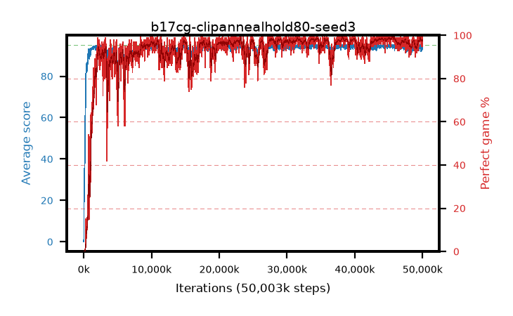

# b17cg-clipannealhold80-seed3

step **50,003,968** · 3052 evals · trailing **94.17** · peak **94.7** @45,285,376 · sef **95.0** · best30 **98.9** @45,793,280

## Config

| | |
|---|---|
| algo | ppo |
| collect_envs | 128 |
| discount | 0.99 |
| eval_interval | 16384 |
| eval_queue | True |
| eval_queue_depth | 16 |
| eval_workers | 8 |
| fc_layers | (320,) |
| graph_eval_episodes | 100 |
| max_steps | 50003968 |
| min_checkpoint_score | 40.0 |
| ppo_adam_epsilon | 1e-07 |
| ppo_anneal_fraction | 0.8 |
| ppo_clip | 0.2 |
| ppo_clip_final | 0.02 |
| ppo_entropy_coef | 0.01 |
| ppo_entropy_coef_final | None |
| ppo_epochs | 4 |
| ppo_gae_lambda | 0.98 |
| ppo_gradient_clipping | 0.5 |
| ppo_horizon | 33.6 |
| ppo_learning_rate | 0.0003 |
| ppo_learning_rate_final | None |
| ppo_minibatch | 256 |
| ppo_normalize_adv | True |
| ppo_rollout | 128 |
| ppo_target_kl | 0.0 |
| ppo_transitions_per_rollout | 16384 |
| ppo_value_loss | huber |
| ppo_vf_coef | 0.5 |
| seed | 3 |
| torch_threads | 1 |

## Evals

| step | avg score | trailing avg | min score | max score | avg reward | perfect % | epsilon |
|---|---|---|---|---|---|---|---|
| 16384 | 0.06 | 0.06 | 0.0 | 1.0 | -2.671 | 0.0 |  |
| 32768 | 1.33 | 0.7 | 0.0 | 5.0 | 0.772 | 0.0 |  |
| 49152 | 27.73 | 15.48 | 0.0 | 58.0 | 22.987 | 0.0 |  |
| ... | ... | ... | ... | ... | ... | ... | ... |
| 49823744 | 94.54 | 94.14 | 59.0 | 95.0 | 191.265 | 98.0 |  |
| 49840128 | 94.18 | 94.13 | 22.0 | 95.0 | 190.907 | 98.0 |  |
| 49856512 | 95.0 | 94.07 | 95.0 | 95.0 | 193.72 | 100.0 |  |
| 49872896 | 94.11 | 94.16 | 6.0 | 95.0 | 191.837 | 99.0 |  |
| 49889280 | 92.44 | 94.02 | 7.0 | 95.0 | 186.189 | 95.0 |  |
| 49905664 | 95.0 | 94.1 | 95.0 | 95.0 | 193.722 | 100.0 |  |
| 49922048 | 92.99 | 94.05 | 3.0 | 95.0 | 186.729 | 95.0 |  |
| 49938432 | 94.47 | 94.08 | 59.0 | 95.0 | 190.204 | 97.0 |  |
| 49954816 | 94.63 | 94.07 | 58.0 | 95.0 | 192.349 | 99.0 |  |
| 49971200 | 93.93 | 94.15 | 10.0 | 95.0 | 189.651 | 97.0 |  |
| 49987584 | 92.87 | 94.1 | 24.0 | 95.0 | 186.607 | 95.0 |  |
| 50003968 | 95.0 | 94.17 | 95.0 | 95.0 | 193.713 | 100.0 |  |
