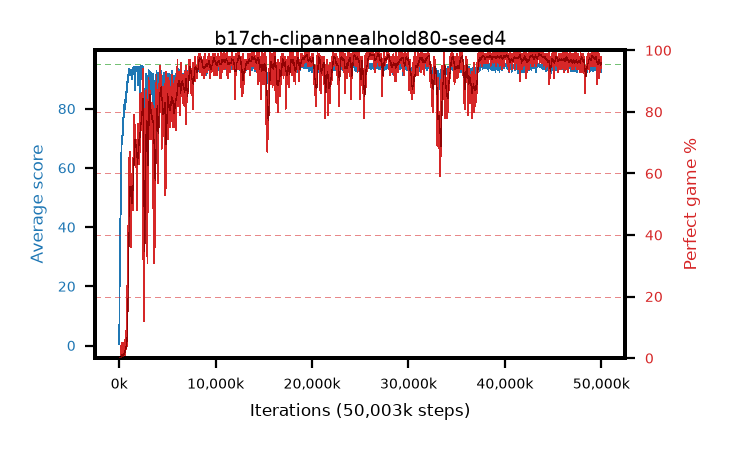

# b17ch-clipannealhold80-seed4

step **50,003,968** · 3052 evals · trailing **93.78** · peak **94.62** @43,401,216 · sef **91.3** · best30 **98.7** @26,296,320

## Config

| | |
|---|---|
| algo | ppo |
| collect_envs | 128 |
| discount | 0.99 |
| eval_interval | 16384 |
| eval_queue | True |
| eval_queue_depth | 16 |
| eval_workers | 8 |
| fc_layers | (320,) |
| graph_eval_episodes | 100 |
| max_steps | 50003968 |
| min_checkpoint_score | 40.0 |
| ppo_adam_epsilon | 1e-07 |
| ppo_anneal_fraction | 0.8 |
| ppo_clip | 0.2 |
| ppo_clip_final | 0.02 |
| ppo_entropy_coef | 0.01 |
| ppo_entropy_coef_final | None |
| ppo_epochs | 4 |
| ppo_gae_lambda | 0.98 |
| ppo_gradient_clipping | 0.5 |
| ppo_horizon | 33.6 |
| ppo_learning_rate | 0.0003 |
| ppo_learning_rate_final | None |
| ppo_minibatch | 256 |
| ppo_normalize_adv | True |
| ppo_rollout | 128 |
| ppo_target_kl | 0.0 |
| ppo_transitions_per_rollout | 16384 |
| ppo_value_loss | huber |
| ppo_vf_coef | 0.5 |
| seed | 4 |
| torch_threads | 1 |

## Evals

| step | avg score | trailing avg | min score | max score | avg reward | perfect % | epsilon |
|---|---|---|---|---|---|---|---|
| 16384 | 0.47 | 0.47 | 0.0 | 4.0 | -0.669 | 0.0 |  |
| 32768 | 17.9 | 14.67 | 0.0 | 37.0 | 13.576 | 0.0 |  |
| 49152 | 23.54 | 16.89 | 4.0 | 50.0 | 18.548 | 0.0 |  |
| ... | ... | ... | ... | ... | ... | ... | ... |
| 49823744 | 94.62 | 94.07 | 62.0 | 95.0 | 191.33 | 98.0 |  |
| 49840128 | 93.37 | 94.04 | 20.0 | 95.0 | 188.088 | 96.0 |  |
| 49856512 | 94.05 | 94.08 | 55.0 | 95.0 | 187.763 | 95.0 |  |
| 49872896 | 92.87 | 93.98 | 18.0 | 95.0 | 184.594 | 93.0 |  |
| 49889280 | 94.72 | 93.97 | 74.0 | 95.0 | 191.424 | 98.0 |  |
| 49905664 | 93.19 | 93.87 | 28.0 | 95.0 | 185.912 | 94.0 |  |
| 49922048 | 93.03 | 93.83 | 26.0 | 95.0 | 185.735 | 94.0 |  |
| 49938432 | 93.2 | 93.77 | 30.0 | 95.0 | 186.905 | 95.0 |  |
| 49954816 | 94.63 | 93.82 | 60.0 | 95.0 | 191.34 | 98.0 |  |
| 49971200 | 94.4 | 93.75 | 42.0 | 95.0 | 191.067 | 98.0 |  |
| 49987584 | 92.46 | 93.74 | 9.0 | 95.0 | 186.145 | 95.0 |  |
| 50003968 | 94.52 | 93.78 | 58.0 | 95.0 | 191.233 | 98.0 |  |
