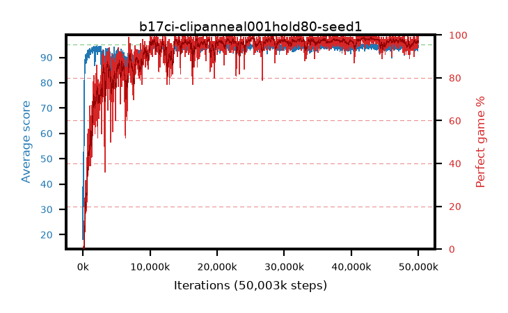

# b17ci-clipanneal001hold80-seed1

step **50,003,968** · 3052 evals · trailing **94.19** · peak **94.61** @28,327,936 · sef **91.5** · best30 **98.7** @41,861,120

## Config

| | |
|---|---|
| algo | ppo |
| collect_envs | 128 |
| discount | 0.99 |
| eval_interval | 16384 |
| eval_queue | True |
| eval_queue_depth | 16 |
| eval_workers | 8 |
| fc_layers | (320,) |
| graph_eval_episodes | 100 |
| max_steps | 50003968 |
| min_checkpoint_score | 40.0 |
| ppo_adam_epsilon | 1e-07 |
| ppo_anneal_fraction | 0.8 |
| ppo_clip | 0.2 |
| ppo_clip_final | 0.001 |
| ppo_entropy_coef | 0.01 |
| ppo_entropy_coef_final | None |
| ppo_epochs | 4 |
| ppo_gae_lambda | 0.98 |
| ppo_gradient_clipping | 0.5 |
| ppo_horizon | 33.6 |
| ppo_learning_rate | 0.0003 |
| ppo_learning_rate_final | None |
| ppo_minibatch | 256 |
| ppo_normalize_adv | True |
| ppo_rollout | 128 |
| ppo_target_kl | 0.0 |
| ppo_transitions_per_rollout | 16384 |
| ppo_value_loss | huber |
| ppo_vf_coef | 0.5 |
| seed | 1 |
| torch_threads | 1 |

## Evals

| step | avg score | trailing avg | min score | max score | avg reward | perfect % | epsilon |
|---|---|---|---|---|---|---|---|
| 16384 | 18.14 | 24.56 | 3.0 | 36.0 | 15.818 | 0.0 |  |
| 32768 | 52.66 | 35.14 | 3.0 | 95.0 | 49.019 | 1.0 |  |
| 49152 | 41.5 | 30.21 | 14.0 | 87.0 | 36.379 | 0.0 |  |
| ... | ... | ... | ... | ... | ... | ... | ... |
| 49823744 | 94.39 | 94.16 | 66.0 | 95.0 | 190.096 | 97.0 |  |
| 49840128 | 94.75 | 94.2 | 70.0 | 95.0 | 192.452 | 99.0 |  |
| 49856512 | 94.2 | 94.16 | 62.0 | 95.0 | 189.917 | 97.0 |  |
| 49872896 | 94.93 | 94.17 | 88.0 | 95.0 | 192.632 | 99.0 |  |
| 49889280 | 93.92 | 94.2 | 61.0 | 95.0 | 187.637 | 95.0 |  |
| 49905664 | 92.68 | 94.13 | 10.0 | 95.0 | 185.407 | 94.0 |  |
| 49922048 | 93.99 | 94.11 | 56.0 | 95.0 | 188.705 | 96.0 |  |
| 49938432 | 94.77 | 94.21 | 78.0 | 95.0 | 190.462 | 97.0 |  |
| 49954816 | 94.76 | 94.19 | 71.0 | 95.0 | 192.447 | 99.0 |  |
| 49971200 | 94.95 | 94.19 | 90.0 | 95.0 | 192.649 | 99.0 |  |
| 49987584 | 94.79 | 94.2 | 78.0 | 95.0 | 190.489 | 97.0 |  |
| 50003968 | 94.89 | 94.19 | 90.0 | 95.0 | 190.592 | 97.0 |  |
