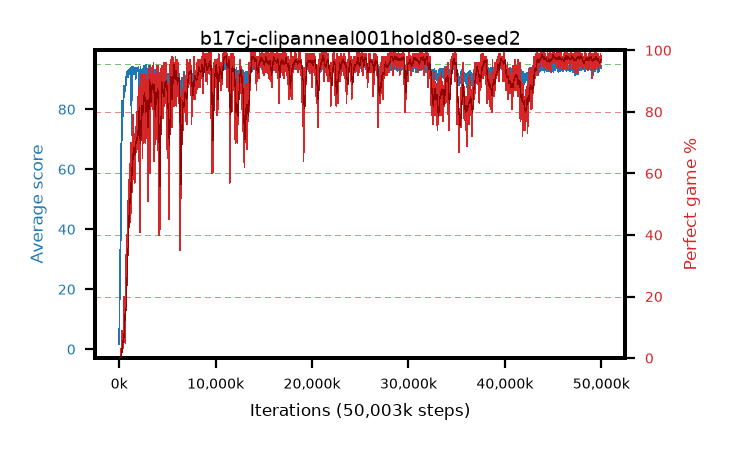

# b17cj-clipanneal001hold80-seed2

step **50,003,968** · 3052 evals · trailing **93.99** · peak **94.37** @28,639,232 · sef **90.2** · best30 **97.8** @44,089,344

## Config

| | |
|---|---|
| algo | ppo |
| collect_envs | 128 |
| discount | 0.99 |
| eval_interval | 16384 |
| eval_queue | True |
| eval_queue_depth | 16 |
| eval_workers | 8 |
| fc_layers | (320,) |
| graph_eval_episodes | 100 |
| max_steps | 50003968 |
| min_checkpoint_score | 40.0 |
| ppo_adam_epsilon | 1e-07 |
| ppo_anneal_fraction | 0.8 |
| ppo_clip | 0.2 |
| ppo_clip_final | 0.001 |
| ppo_entropy_coef | 0.01 |
| ppo_entropy_coef_final | None |
| ppo_epochs | 4 |
| ppo_gae_lambda | 0.98 |
| ppo_gradient_clipping | 0.5 |
| ppo_horizon | 33.6 |
| ppo_learning_rate | 0.0003 |
| ppo_learning_rate_final | None |
| ppo_minibatch | 256 |
| ppo_normalize_adv | True |
| ppo_rollout | 128 |
| ppo_target_kl | 0.0 |
| ppo_transitions_per_rollout | 16384 |
| ppo_value_loss | huber |
| ppo_vf_coef | 0.5 |
| seed | 2 |
| torch_threads | 1 |

## Evals

| step | avg score | trailing avg | min score | max score | avg reward | perfect % | epsilon |
|---|---|---|---|---|---|---|---|
| 16384 | 1.71 | 1.71 | 0.0 | 5.0 | -0.717 | 0.0 |  |
| 32768 | 12.6 | 7.15 | 4.0 | 23.0 | 7.6 | 0.0 |  |
| 49152 | 19.55 | 11.29 | 6.0 | 50.0 | 14.512 | 0.0 |  |
| ... | ... | ... | ... | ... | ... | ... | ... |
| 49823744 | 94.47 | 94.11 | 64.0 | 95.0 | 190.199 | 97.0 |  |
| 49840128 | 93.98 | 94.01 | 1.0 | 95.0 | 190.706 | 98.0 |  |
| 49856512 | 94.33 | 94.04 | 65.0 | 95.0 | 190.044 | 97.0 |  |
| 49872896 | 94.0 | 94.0 | 65.0 | 95.0 | 187.732 | 95.0 |  |
| 49889280 | 94.16 | 93.99 | 55.0 | 95.0 | 188.89 | 96.0 |  |
| 49905664 | 94.45 | 94.03 | 57.0 | 95.0 | 191.175 | 98.0 |  |
| 49922048 | 94.33 | 93.97 | 28.0 | 95.0 | 192.052 | 99.0 |  |
| 49938432 | 93.83 | 93.96 | 54.0 | 95.0 | 188.558 | 96.0 |  |
| 49954816 | 94.37 | 93.98 | 60.0 | 95.0 | 190.095 | 97.0 |  |
| 49971200 | 94.21 | 93.98 | 53.0 | 95.0 | 190.929 | 98.0 |  |
| 49987584 | 93.94 | 94.06 | 32.0 | 95.0 | 189.676 | 97.0 |  |
| 50003968 | 94.53 | 93.99 | 65.0 | 95.0 | 191.251 | 98.0 |  |
