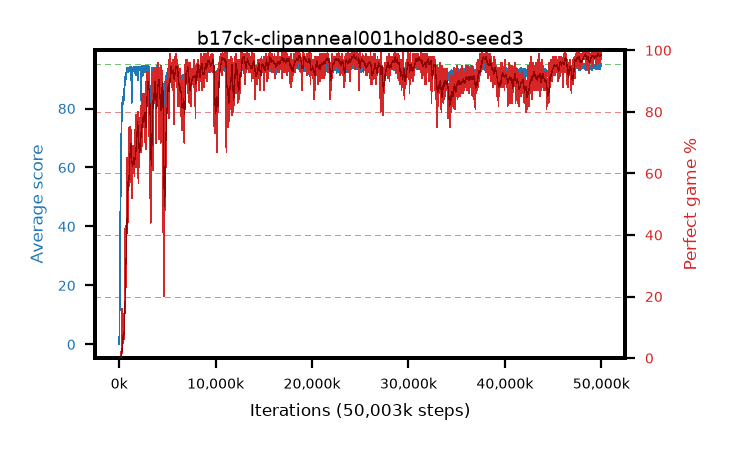

# b17ck-clipanneal001hold80-seed3

step **50,003,968** · 3052 evals · trailing **94.52** · peak **94.52** @50,003,968 · sef **92.2** · best30 **98.5** @49,971,200

## Config

| | |
|---|---|
| algo | ppo |
| collect_envs | 128 |
| discount | 0.99 |
| eval_interval | 16384 |
| eval_queue | True |
| eval_queue_depth | 16 |
| eval_workers | 8 |
| fc_layers | (320,) |
| graph_eval_episodes | 100 |
| max_steps | 50003968 |
| min_checkpoint_score | 40.0 |
| ppo_adam_epsilon | 1e-07 |
| ppo_anneal_fraction | 0.8 |
| ppo_clip | 0.2 |
| ppo_clip_final | 0.001 |
| ppo_entropy_coef | 0.01 |
| ppo_entropy_coef_final | None |
| ppo_epochs | 4 |
| ppo_gae_lambda | 0.98 |
| ppo_gradient_clipping | 0.5 |
| ppo_horizon | 33.6 |
| ppo_learning_rate | 0.0003 |
| ppo_learning_rate_final | None |
| ppo_minibatch | 256 |
| ppo_normalize_adv | True |
| ppo_rollout | 128 |
| ppo_target_kl | 0.0 |
| ppo_transitions_per_rollout | 16384 |
| ppo_value_loss | huber |
| ppo_vf_coef | 0.5 |
| seed | 3 |
| torch_threads | 1 |

## Evals

| step | avg score | trailing avg | min score | max score | avg reward | perfect % | epsilon |
|---|---|---|---|---|---|---|---|
| 16384 | 0.08 | 0.08 | 0.0 | 2.0 | -3.319 | 0.0 |  |
| 32768 | 4.15 | 2.12 | 0.0 | 12.0 | 3.258 | 0.0 |  |
| 49152 | 17.63 | 7.29 | 0.0 | 37.0 | 13.021 | 0.0 |  |
| ... | ... | ... | ... | ... | ... | ... | ... |
| 49823744 | 93.32 | 94.46 | 8.0 | 95.0 | 188.041 | 96.0 |  |
| 49840128 | 94.63 | 94.48 | 58.0 | 95.0 | 192.336 | 99.0 |  |
| 49856512 | 94.71 | 94.48 | 66.0 | 95.0 | 192.421 | 99.0 |  |
| 49872896 | 94.92 | 94.46 | 90.0 | 95.0 | 191.623 | 98.0 |  |
| 49889280 | 95.0 | 94.47 | 95.0 | 95.0 | 193.697 | 100.0 |  |
| 49905664 | 94.0 | 94.44 | 22.0 | 95.0 | 190.715 | 98.0 |  |
| 49922048 | 94.09 | 94.44 | 4.0 | 95.0 | 191.799 | 99.0 |  |
| 49938432 | 94.95 | 94.45 | 90.0 | 95.0 | 192.654 | 99.0 |  |
| 49954816 | 94.53 | 94.51 | 55.0 | 95.0 | 191.247 | 98.0 |  |
| 49971200 | 94.82 | 94.49 | 82.0 | 95.0 | 191.531 | 98.0 |  |
| 49987584 | 94.23 | 94.51 | 30.0 | 95.0 | 189.952 | 97.0 |  |
| 50003968 | 95.0 | 94.52 | 95.0 | 95.0 | 193.701 | 100.0 |  |
