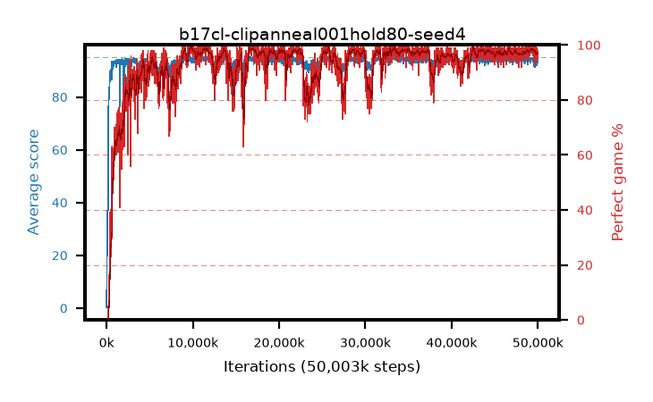

# b17cl-clipanneal001hold80-seed4

step **50,003,968** · 3052 evals · trailing **93.8** · peak **94.66** @11,665,408 · sef **93.3** · best30 **98.8** @9,928,704

## Config

| | |
|---|---|
| algo | ppo |
| collect_envs | 128 |
| discount | 0.99 |
| eval_interval | 16384 |
| eval_queue | True |
| eval_queue_depth | 16 |
| eval_workers | 8 |
| fc_layers | (320,) |
| graph_eval_episodes | 100 |
| max_steps | 50003968 |
| min_checkpoint_score | 40.0 |
| ppo_adam_epsilon | 1e-07 |
| ppo_anneal_fraction | 0.8 |
| ppo_clip | 0.2 |
| ppo_clip_final | 0.001 |
| ppo_entropy_coef | 0.01 |
| ppo_entropy_coef_final | None |
| ppo_epochs | 4 |
| ppo_gae_lambda | 0.98 |
| ppo_gradient_clipping | 0.5 |
| ppo_horizon | 33.6 |
| ppo_learning_rate | 0.0003 |
| ppo_learning_rate_final | None |
| ppo_minibatch | 256 |
| ppo_normalize_adv | True |
| ppo_rollout | 128 |
| ppo_target_kl | 0.0 |
| ppo_transitions_per_rollout | 16384 |
| ppo_value_loss | huber |
| ppo_vf_coef | 0.5 |
| seed | 4 |
| torch_threads | 1 |

## Evals

| step | avg score | trailing avg | min score | max score | avg reward | perfect % | epsilon |
|---|---|---|---|---|---|---|---|
| 16384 | 0.27 | 0.27 | 0.0 | 2.0 | -0.505 | 0.0 |  |
| 32768 | 16.41 | 15.59 | 1.0 | 36.0 | 12.052 | 0.0 |  |
| 49152 | 23.44 | 11.86 | 7.0 | 52.0 | 18.41 | 0.0 |  |
| ... | ... | ... | ... | ... | ... | ... | ... |
| 49823744 | 93.99 | 93.91 | 12.0 | 95.0 | 187.696 | 95.0 |  |
| 49840128 | 94.7 | 94.01 | 65.0 | 95.0 | 192.397 | 99.0 |  |
| 49856512 | 92.16 | 93.93 | 2.0 | 95.0 | 185.874 | 95.0 |  |
| 49872896 | 94.32 | 93.9 | 60.0 | 95.0 | 191.032 | 98.0 |  |
| 49889280 | 94.38 | 93.93 | 64.0 | 95.0 | 191.083 | 98.0 |  |
| 49905664 | 94.29 | 93.91 | 55.0 | 95.0 | 190.986 | 98.0 |  |
| 49922048 | 94.17 | 93.91 | 46.0 | 95.0 | 190.836 | 98.0 |  |
| 49938432 | 93.62 | 93.87 | 52.0 | 95.0 | 188.332 | 96.0 |  |
| 49954816 | 93.94 | 93.86 | 38.0 | 95.0 | 187.624 | 95.0 |  |
| 49971200 | 93.77 | 93.84 | 13.0 | 95.0 | 189.49 | 97.0 |  |
| 49987584 | 93.19 | 93.82 | 12.0 | 95.0 | 187.906 | 96.0 |  |
| 50003968 | 93.46 | 93.8 | 6.0 | 95.0 | 190.164 | 98.0 |  |
